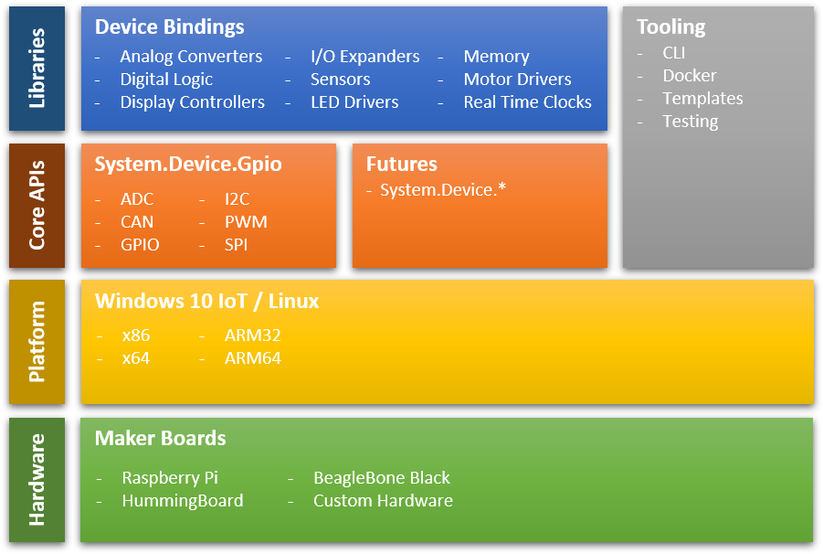

Our goal is to create a set of world-class APIs and tooling that will support a rich .NET IoT ecosystem.  Below shows a structure of components as part of our roadmap.

**NOTE**: Not all components listed below are included with current previews.

We have the following deliverables on our intermediate-term roadmap (not in order of completion):

* [x] Support General-purpose input/output protocols: GPIO, SPI, I2C, and PWM
* [ ] Support common serial protocols: RS-485 Serial Port, CAN bus, Modbus
* [ ] Support digital audio bus protocols: I2S
* [x] Support Raspberry Pi 3 on Linux and Windows 10 IoT Core RS5
* [ ] Support Hummingboard Edge on Linux and Windows 10 IoT Core RS5
* [ ] Support BeagleBoard Black on Linux and Windows 10 IoT Core RS5
* [x] Support sysfs (/sys/class/gpio) for Generic/Portable Device Driver on Linux Kernel 3.6+
* [ ] Support libgpiod (/dev/gpiochipX) for Generic/Portable Device Driver on Linux Kernel 4.8+
* [ ] Stabilize System.Device.* API
* [ ] Publish System.Device.* API to NuGet.org
* [x] Provide dockerfiles for all samples
* [ ] Publish Docker images for a subset of samples
* [ ] Support x64
* [x] Support ARM32
* [ ] Support ARM64
* [ ] Support Device Bindings for common sensors and microcontrollers such as those bundled with the [Microsoft IoT Starter Pack](https://www.adafruit.com/product/2733)
* [ ] Support Device Bindings and Canvas Widgets for LCDS, multi-panel [LED matrices](https://www.adafruit.com/product/607), and Displays
* [ ] Support Device Bindings for servo and stepper motors, motor controllers, and drives
* [ ] Stabilize IoT.Device.* APIs for Device Bindings
* [ ] Publish IoT.Device.* Device Bindings to NuGet.org
  
More libraries and features are coming soon. Stay tuned!