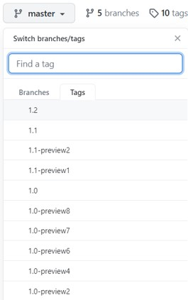

[](https://gitter.im/dotnet/iot)
[](https://discord.gg/kqWhBbj)

# .NET IoT Libraries

.NET can be used to build applications for [IoT](https://en.wikipedia.org/wiki/Internet_of_things) devices and scenarios. IoT applications typically interact with sensors, displays and input devices that require the use of [GPIO pins](https://en.wikipedia.org/wiki/General-purpose_input/output), serial ports or similar hardware.

> **IMPORTANT**: This is the GitHub repo for the libraries. You might want to start with our [official documentation](https://docs.microsoft.com/dotnet/iot/).

This repository contains the [System.Device.Gpio](https://www.nuget.org/packages/System.Device.Gpio) library and implementations for various boards like [Raspberry Pi](https://www.raspberrypi.org/) and [Hummingboard](https://www.solid-run.com/nxp-family/hummingboard/).

The repository also contains [Iot.Device.Bindings](https://www.nuget.org/packages/Iot.Device.Bindings), a growing set of community-maintained [device bindings](src/devices/README.md) for IoT components.

> **NOTE**: This repository is still in experimental stage and all APIs are subject to changes.

## Hardware requirements

While most of the bindings and examples in this project require and are designed to support specific hardware (such as [LCD displays](src/devices/CharacterLcd), [temperature sensors](src/devices/Dhtxx), [single-board computers](src/devices/Board/RaspberryPiBoard.cs), [microcontrollers](src/devices/Arduino), etc.), the library itself tries to be as hardware-independent as possible. Some bindings are even written to showcase the use of IOT interfaces with hardware that is already present in normal desktop computers (such as [keyboards](src/devices/Board/KeyboardGpioDriver.cs) or [CPU temperature sensors](src/devices/HardwareMonitor)). So to get started, you do not need expensive hardware. Or you can start out with cheap stuff, such as an Arduino Uno. 

## .NET Versions

Both libraries in this repository are cross-targetting .NET Standard 2.0, .NET Core 2.1 and .NET 5.0. They can be used from any project targeting .NET Core 2.1 or higher, and also from .NET Framework or mono. If you are looking at a Micro Controller Unit (MCU) support, check [.NET nanoFramework](https://github.com/nanoframework/).

The sample projects target the latest stable .NET Version. This applies to the sample projects with each device as well as the example projects on the `/samples` directory.

## How to Install

You can install the latest daily pre-release build of the .NET System.Device.Gpio and Iot.Device.Bindings NuGet packages from the blob feed.
  
### NuGet.exe

```shell
nuget install System.Device.Gpio -PreRelease -Source https://pkgs.dev.azure.com/dnceng/public/_packaging/dotnet6/nuget/v3/index.json
nuget install Iot.Device.Bindings -PreRelease -Source https://pkgs.dev.azure.com/dnceng/public/_packaging/dotnet6/nuget/v3/index.json
```
### Official Build Status

[](https://dev.azure.com/dnceng/public/_build/latest?definitionId=268&branchName=main)

### .NET CLI

```shell
dotnet add package System.Device.Gpio --source https://pkgs.dev.azure.com/dnceng/public/_packaging/dotnet6/nuget/v3/index.json
dotnet add package Iot.Device.Bindings --source https://pkgs.dev.azure.com/dnceng/public/_packaging/dotnet6/nuget/v3/index.json
```

## Contributing

For information on how to build this repository and to add new device bindings, please head out to [Contributing](Documentation/CONTRIBUTING.md).

Please contribute. We are primarily interested in the following:

* Improving quality and capability of the drivers for supported boards.
* Implementations for additional boards.
* [.NET device bindings](src/devices) for a wide variety of sensors, chips, displays and other components.
* Request a device binding or protocol that you need for your project ([file an issue](https://github.com/dotnet/iot/issues)).
* Links to blog posts or tweets that showcase .NET Core being used for great IoT scenarios ([file an issue](https://github.com/dotnet/iot/issues)).

## Getting Started

After installing, please see the following areas to learn more:

* [Official Documentation](https://docs.microsoft.com/dotnet/iot/) - Concepts, quickstarts, tutorials, and API reference documentation.
* [API Documentation](https://docs.microsoft.com/dotnet/api/?view=iot-dotnet-1.3) - Direct link to API reference documentation for all public interfaces. Be sure to choose the library version you are using.
* [Microsoft Learn interactive learning module](https://docs.microsoft.com/learn/modules/create-iot-device-dotnet/)
* [Let's Learn .NET: IoT livestream (September 2021)](https://www.youtube.com/watch?v=sKaSBh1M4M4)
* [.NET IoT 101 (Jan 2020)](https://channel9.msdn.com/Series/IoT-101) - An introduction series on how to create .NET IoT applications with a Raspberry Pi.
* [Hardware Documentation](Documentation/README.md) - Resources related to electronics, devices, vendors, software and other IoT topics.
* [Samples](samples/README.md) - Step-by-step instructions on building your first app.
* [Roadmap](Documentation/roadmap.md) - Areas planned or currently being worked on.

All bindings (src/devices) contains a `samples` folder where you will find examples on how to use each of the devices, sensor, displays and other components.

**Important**: Please make sure you are using tag that correspond to your package version to browse and reuse the samples' code. 



Once you have selected the right branch, you can browse the repository. The main branch contains code that is always the latest and may not been yet released to a package. So if you are using the 1.2 package, please select 1.2 tag before browsing the source code.

### Tutorials

* [Web service using SenseHat by Dawid Borycki (Aug 2019)](https://msdn.microsoft.com/magazine/mt833493)

## Community

This project has adopted the code of conduct defined by the [Contributor Covenant](https://contributor-covenant.org/)
to clarify expected behavior in our community. For more information, see the [.NET Foundation Code of Conduct](https://www.dotnetfoundation.org/code-of-conduct).

## License

.NET (including the iot repo) is licensed under the [MIT license](LICENSE).
