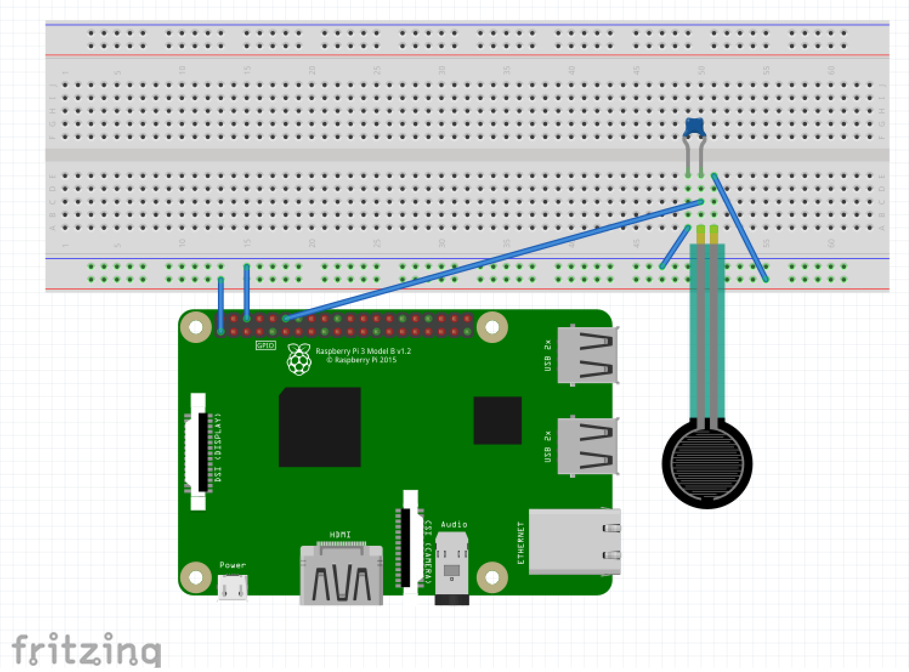

# Using Fsr 408 (Force sensitive resistor) with Raspberry Pi

Force sensitive resistors change its resistivity depending on how much it is pressed. This feature allows to detect physical pressure, squeezing and weight. This sample demonstrates use of FSR Interlink 402 model, other types of FSR sensors usage will be pretty identical.

FSR generates analog signal so it should be connected to analog input of a controller, as Raspberry Pi haven't analog input one can use ADC converter in between FSR and Rasp Pi. Also you can use collecting capacitor and measure its fill up time to determine if FSR is pressed. From my experience if you need more accurate measurement better to use ADC (Analog to Digital Converter). Else if only need to check/determine if FSR is pressed or not using capacitor could work. This example demonstrates both case.

## Detecting pressure/squeezing with Fsr408, Mcp3008 and Raspberry Pi 

 In below example MCP3008 Analog to Digital Converter used for converting FSR analog output into digital. Read value then can be used for calculating voltage, resistance and pressure force approxinmately. We need to create Mcp3008 instance depending on how you connected it to the controller, [please refer this for more about binding MCP3008](https://github.com/dotnet/iot/tree/master/src/devices/Mcp3008/samples)

Code sample for [measuring pressure/squeezing with Fsr408 and ADC converter MCP3008](FsrWithAdcSample.cs#L58-L75):

```csharp
    using (Mcp3008 adcConvertor = new Mcp3008(18, 23, 24, 25))
    {
        while (true)
            {
                int value = adcConvertor.Read(_pinNumber);
                int voltage = CalculateVoltage(value);
                int resistance = CalculateFsrResistance(voltage);
                int force = CalculateForce(resistance);
                Console.WriteLine($"Read value: {value}, voltage: {voltage}, resistance: {resistance}, approximate force in Newtons: {force}");
                Thread.Sleep(500);
            }
        }
    }
```


Here we supplied 3.3 volt power to FSR, if you use other power source (like 5V) please update _voltageSupplied variable with corresponding value. Also used 10 kOhm resistor, if you are using resistor with diffent resistance please update _resistance variable value for calculating voltage, FSR resistance and pressure force correctly.


## Hardware elements

The following elements are used in this sample:

* [Force Sensitive Resistor](https://www.adafruit.com/product/166)
* [MCP3008](https://www.adafruit.com/product/856)
* [Pull down Resistor 10 kOhm](https://www.adafruit.com/product/2784)


## Detecting touch/squeezing with Fsr408, capacitor and Raspberry Pi 

Using capacitor for reading FSR analog input was producing kind of noisy signal, so from my experience if you only need to check/determine if FSR is pressed or not use of capacitor could serve well, but if you need more fine tuned measurement better use Analog to Digital Converter.

You can use the following code to [detect if Force Sensitive Resistor is pressed, using - capacitor](FsrWithCapacitorSample.cs#L53-L65):

```csharp
    while (true)
    {
        long value = ReadCapacitorChargingDuration();

        if (value == 30000)
        {   // 30000 is count limit, if we got this count it means Fsr has its highest resistance, so it is not pressed
            Console.WriteLine("Not pressed");
        }
        else
        {
            Console.WriteLine("Pressed");
        }
        Thread.Sleep(500);
    }
```



Here we are using pin 18 for input, if you are using different pin please update _pinNumber variable.

## Hardware elements

The following elements are used in this sample:

* [Force Sensitive Resistor](https://www.adafruit.com/product/166)
* Capacitor 0.1 micro Farade

## References 
The sample is based on following resources:

* [FSR data sheet](https://cdn-learn.adafruit.com/assets/assets/000/010/126/original/fsrguide.pdf)
* [Reading Analog Input from a Potentiometer](https://github.com/dotnet/iot/tree/master/src/devices/Mcp3008/samples) 
* [Using an FSR](https://learn.adafruit.com/force-sensitive-resistor-fsr/using-an-fsr)
* [Basic Resistor Sensor Reading on Raspberry Pi](https://learn.adafruit.com/basic-resistor-sensor-reading-on-raspberry-pi)
