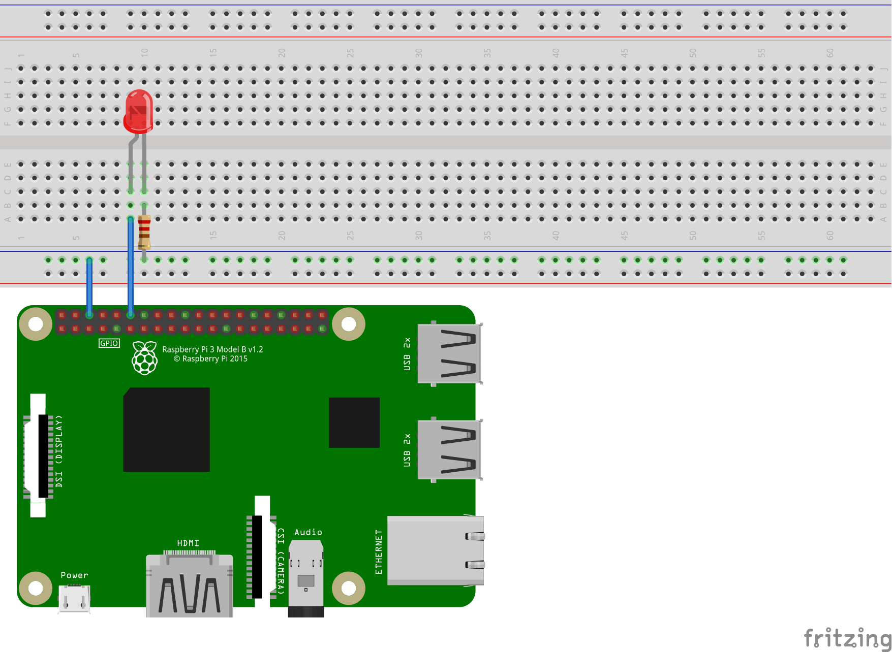

# Blink an LED with .NET Core on a Raspberry Pi

This [sample](Program.cs) demonstrates blinking an LED. The sample also demonstrates the most basic usage of the [.NET Core GPIO library](https://www.nuget.org/packages/System.Device.Gpio).

The following code toggles a GPIO pin on and off, which powers the LED.

```csharp
int pin = 18;
GpioController controller = new GpioController();
controller.OpenPin(pin, PinMode.Output);

int lightTimeInMilliseconds = 1000;
int dimTimeInMilliseconds = 200;
            
while (true)
{
    Console.WriteLine($"Light for {lightTimeInMilliseconds}ms");
    controller.Write(pin, PinValue.High);
    Thread.Sleep(lightTimeInMilliseconds);
    Console.WriteLine($"Dim for {dimTimeInMilliseconds}ms");
    controller.Write(pin, PinValue.Low);
    Thread.Sleep(dimTimeInMilliseconds); 
}
```

The following [fritzing diagram](rpi-led.fzz) demonstrates how you should wire your device to match the code above.



## Extending the sample to multiple LEDs

The sample can be be adapted to use multiple LEDs.

```csharp
var pins = new int[] {18, 24, 25};;
var lightTimeInMilliseconds = 1000;
var dimTimeInMilliseconds = 200;

Console.WriteLine($"Let's blink an LED!");
using GpioController controller = new GpioController();

foreach (var pin in pins)
{
    controller.OpenPin(pin, PinMode.Output);
    Console.WriteLine($"GPIO pin enabled for use: {pin}");
}

while (true)
{
    foreach (var pin in pins)
    {
        Console.WriteLine($"Light for {lightTimeInMilliseconds}ms");
        controller.Write(pin, PinValue.High);
        Thread.Sleep(lightTimeInMilliseconds);

        Console.WriteLine($"Dim for {dimTimeInMilliseconds}ms");
        controller.Write(pin, PinValue.Low);
        Thread.Sleep(dimTimeInMilliseconds);
    }
}
```

The following [fritzing diagram](rpi-led-multiple.fzz) demonstrates how you should wire your device to match the code above.


## Resources

* [Diffused LEDs](https://www.adafruit.com/product/297)
* [All about LEDs](https://learn.adafruit.com/all-about-leds)
- [Blinking an LED with Arduino](https://learn.adafruit.com/adafruit-arduino-lesson-2-leds/blinking-the-led)
- [Blinking an LED with Python](https://learn.adafruit.com/blinking-an-led-with-beaglebone-black/writing-a-program)