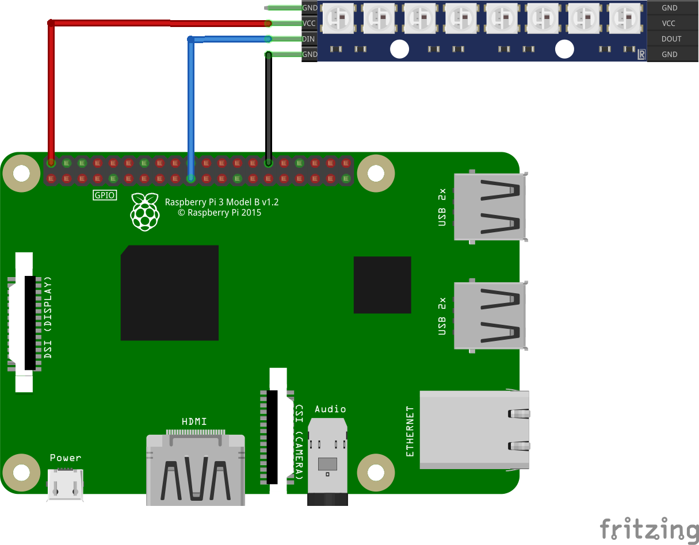

# Drive Neo pixel strip (x8) from Raspberry Pi

This [sample](Program.cs) demonstrates how to use the [Bitmap library](../../src/Iot.Device.Bindings/Utils/BitmapImage.cs) and the [Neo pixel binding](../../src/devices/Ws2812B/Ws2812B.cs) to drive an 8 Neo Pixel stick from a Raspberry Pi.

## Run the sample

This sample can be built and run with .NET Core 3.0. Use the following commands from the root of the repo:

```console
cd samples
cd neo-pixels-x8
dotnet build -c release -o out
sudo dotnet out/neo-pixels-x8.dll
```

## Breadboard layout

The following [fritzing diagram](rpi-neo-pixels.fzz) demonstrates how you should wire your device in order to run the [program](Program.cs). It uses the GND, 5V and MOSI pins on the Raspberry Pi.



## Hardware elements

The following elements are used in this sample:

* [Raspberry Pi 3](https://www.adafruit.com/product/3055)
* [Neo pixels x8 stick](https://www.adafruit.com/product/1426)

## Resources

* [Using .NET Core for IoT Scenarios](../README.md)
