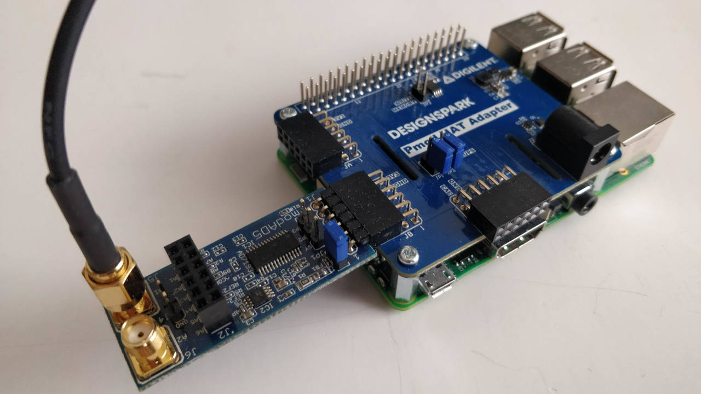
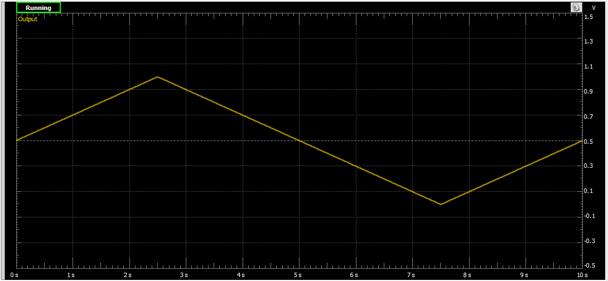

# AD7193 - Samples

## Required hardware
* [Analog Devices AD7193](https://www.analog.com/media/en/technical-documentation/data-sheets/AD7193.pdf)
* Any supported IoT device with an SPI bus

## Hardware used for testing
* [Pmod AD5](https://reference.digilentinc.com/reference/pmod/pmodad5/start) (an AD7193 frontend)
* [Raspberry Pi 3 Model B+](https://www.raspberrypi.org/products/raspberry-pi-3-model-b-plus/)
* [Pmod HAT Adapter](https://reference.digilentinc.com/reference/add-ons/pmod-hat/reference-manual) (Raspberry Pi Pmod HAT)
* [Analog Discovery 2](https://reference.digilentinc.com/reference/instrumentation/analog-discovery-2/reference-manual) (for signal generation)
* BNC to SMA cable

## Test unit and signal input


The oscilloscope output is a [triangle waveform with 1V of peak-to-peak amplitude](AD2_Oscilloscope_Input.png), and that's the input of the PmodAD5.



## Installation on Raspberry Pi
1, Before you publish your binaries on Raspberry Pi, you must restore the .NET Core packages for the project
> dotnet restore

2, Open and edit the credentials in the [DeployToPi.ps1](DeployToPi.ps1) file

3, Run the [DeployToPi.ps1](DeployToPi.ps1) script in a PowerShell window (you will also need the [WinSCP .NET assembly](https://winscp.net/eng/downloads.php))
> .\DeployToPi.ps1

4, You can optionally attach the Visual Studio Debugger, and debug your application running on the Pi:

    a, Open Visual Studio
    b, Debug / Attach to Process... (Ctrl+Alt+P)
    c, Type: SSH, Target: <IP address of your Raspberry Pi>, hit Enter
    d, Enter username and password, hit Connect
    e, Enter "AD7193" to the filter textbox, select the process
    f, Check "Managed (.NET Core for Unix)"
    g, Next time you can quickly Reattach to Process... (Shift+Alt+P)

## Code
```C#
private static Ad7193 ad7193;
private static DateTime firstDataRead;
private static double lastChecked = 0;
private static int lastCount = 0;
private static int samplesTaken = 0;


static void Main(string[] args)
{
	// set SPI bus ID: 0
	// AD7193 CS Pin: 1
	SpiConnectionSettings settings = new SpiConnectionSettings(0, 1);
	settings.ClockFrequency = Ad7193.MaximumSpiFrequency;
	settings.Mode = SpiMode.Mode3;
	SpiDevice ad7193SpiDevice = SpiDevice.Create(settings);


	ad7193 = new Ad7193(ad7193SpiDevice);
	ad7193.AdcValueReceived += Ad7193_AdcValueReceived;

	Console.WriteLine($"-- Resetting and calibrating AD7193.");
	ad7193.Reset();
	ad7193.PGAGain = Ad7193.Gain.X1;
	ad7193.Averaging = Ad7193.AveragingModes.Off;
	ad7193.AnalogInputMode = Ad7193.AnalogInputModes.EightPseudoDifferentialAnalogInputs;
	ad7193.AppendStatusRegisterToData = true;
	ad7193.JitterCorrection = true;
	ad7193.Filter = 0;

	Console.WriteLine($"AD7193 before calibration: offset={ad7193.Offset.ToString("x")}, full-scale={ad7193.FullScale.ToString("x")}");
	ad7193.Calibrate();
	Console.WriteLine($"AD7193  after calibration: offset={ad7193.Offset.ToString("x")}, full-scale={ad7193.FullScale.ToString("x")}");


	Console.WriteLine("Starting 100 single conversions on CH0...");
	ad7193.ActiveChannels = Ad7193.Channel.CH00;

	for (int i = 0; i < 100; i++)
	{
		ad7193.StartSingleConversion();
		ad7193.WaitForADC();
		ad7193.ReadADCValue();
		Thread.Sleep(25);
	}

	Thread.Sleep(1000);


	Console.WriteLine();
	Console.WriteLine();
	Console.WriteLine("Starting continuous conversion on CH0 and CH1...");
	ad7193.ActiveChannels = Ad7193.Channel.CH00 | Ad7193.Channel.CH01;
	ad7193.StartContinuousConversion();

	int loopcounter = 0;
	while (true)
	{
		loopcounter++;
		if (ad7193.HasErrors || (loopcounter % 50 == 0))
		{
			Console.WriteLine();
			Console.WriteLine($"AD7193 status: {ad7193.Status}");
			Console.WriteLine($"AD7193 mode: {ad7193.Mode}");
			Console.WriteLine($"AD7193 config: {ad7193.Config}");
			Console.WriteLine();
			Thread.Sleep(1500);
		}
		Thread.Sleep(250);
	}
}

private static void Ad7193_AdcValueReceived(object sender, Iot.Device.Ad7193.AdcValueReceivedEventArgs e)
{
	if (firstDataRead == DateTime.MinValue) firstDataRead = DateTime.UtcNow;
	double secondsElapsed = (DateTime.UtcNow - firstDataRead).TotalSeconds;

	samplesTaken++;

	// show the results in every 0.25 seconds
	if (secondsElapsed - lastChecked > 0.25)
	{
		double sps = (double)(samplesTaken - lastCount) / (secondsElapsed - lastChecked);

		lastCount = samplesTaken;
		lastChecked = secondsElapsed;

		Iot.Device.Ad7193.AdcValue adcValue = e.AdcValue;

		Console.WriteLine($"Channel {adcValue.Channel.ToString().PadLeft(2)}: {adcValue.Voltage.ToString("0.0000").PadLeft(11)} V | {adcValue.Raw.ToString("N0").PadLeft(13)} | {sps.ToString("N1").PadLeft(9)} SPS");
	}
}
```

## Result
You can see that the values are oscillating between 0.0 V and 1.0 V at the rate of 4800 SPS, as expected.


