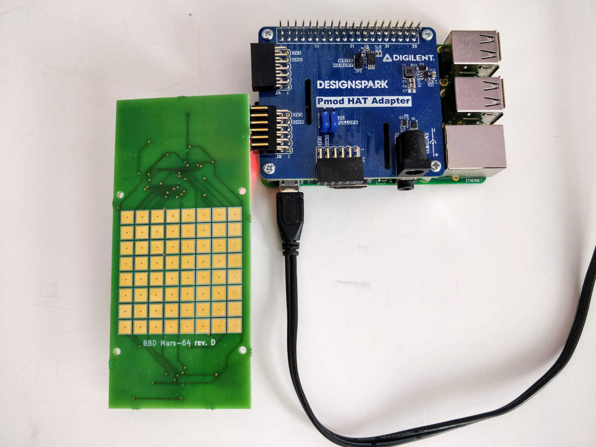
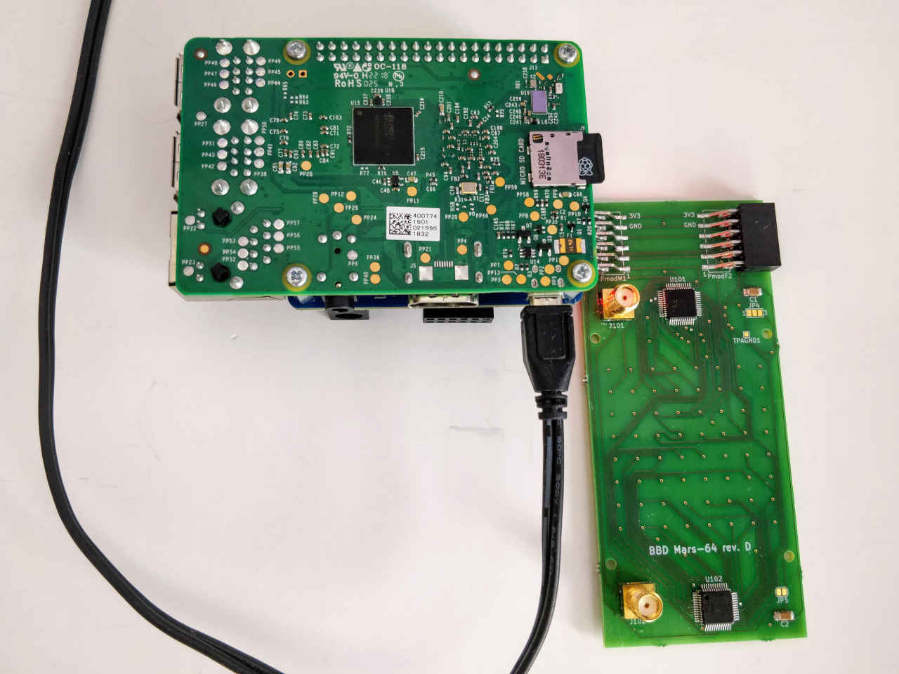
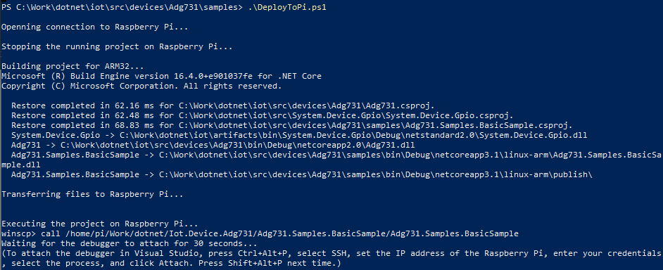
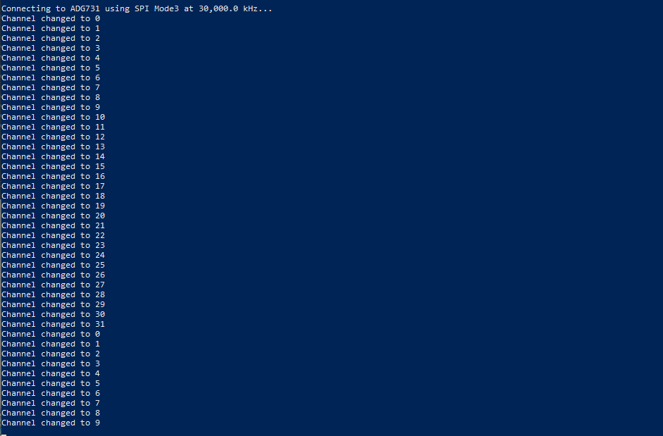

# ADG731 - Samples

## Required hardware
* [Analog Devices ADG731](https://www.analog.com/media/en/technical-documentation/data-sheets/ADG725_731.pdf)
* Any supported IoT device with an SPI bus

## Hardware used for testing
* [Bio Balance Detector Mars-64](http://www.biobalancedetector.com/) (with 2x ADG731s)
* [Raspberry Pi 3 Model B+](https://www.raspberrypi.org/products/raspberry-pi-3-model-b-plus/)
* [Pmod HAT Adapter](https://reference.digilentinc.com/reference/add-ons/pmod-hat/reference-manual) (Raspberry Pi Pmod HAT)
* [Extech MN47 multimeter](http://www.extech.com/products/MN47) (for verifying switch completion)

## Test unit and signal input





## Installation on Raspberry Pi
1, Before you publish your binaries on Raspberry Pi, you must restore the .NET Core packages for the project
> dotnet restore

2, Open and edit the credentials in the [DeployToPi.ps1](DeployToPi.ps1) file

3, Run the [DeployToPi.ps1](DeployToPi.ps1) script in a PowerShell window (you will also need the [WinSCP .NET assembly](https://winscp.net/eng/downloads.php))
> .\DeployToPi.ps1



4, You can optionally attach the Visual Studio Debugger, and debug your application running on the Pi:

    a, Open Visual Studio
    b, Debug / Attach to Process... (Ctrl+Alt+P)
    c, Type: SSH, Target: <IP address of your Raspberry Pi>, hit Enter
    d, Enter username and password, hit Connect
    e, Enter "ADG731" to the filter textbox, select the process
    f, Check "Managed (.NET Core for Unix)"
    g, Next time you can quickly Reattach to Process... (Shift+Alt+P)

## Code
```C#
private static Adg731 s_adg731;

public static void Main()
{
	WaitForDebugger();

	// Digilent Pmod HAT Adapter
	// JA - Bus 0, CS 0
	// JB - Bus 0, CS 1
	SpiConnectionSettings settings = new SpiConnectionSettings(0, 1)
	{
		ClockFrequency = ((ISpiDeviceMetadata)Adg731.GetDeviceMetadata()).MaximumSpiFrequency,
		Mode = SpiMode.Mode3
	};
	SpiDevice adg731SpiDevice = SpiDevice.Create(settings);

	Console.WriteLine($"Connecting to ADG731 using SPI {adg731SpiDevice.ConnectionSettings.Mode.ToString()} at {adg731SpiDevice.ConnectionSettings.ClockFrequency / 1000.0:N1} kHz...");

	s_adg731 = new Adg731(adg731SpiDevice);
	s_adg731.IsEnabled = true;
	s_adg731.IsSelected = true;

	int loopcounter = 0;
	while (true)
	{
		s_adg731.ActiveChannel = loopcounter % ((IMultiplexerDeviceMetadata)Adg731.GetDeviceMetadata()).MultiplexerChannelCount;
		Console.WriteLine($"Channel changed to {s_adg731.ActiveChannel}");
		loopcounter++;
		Thread.Sleep(500);
	}
}

private static void WaitForDebugger()
{
	int i = 0;
	Console.WriteLine("Waiting for the debugger to attach for 30 seconds... ");
	Console.WriteLine("(To attach the debugger in Visual Studio, press Ctrl+Alt+P, select SSH, set the IP address of the Raspberry Pi, enter your credentials, select the process, and click Attach. Press Shift+Alt+P next time.) ");
	while (true)
	{
		Console.WriteLine(++i + " ");
		if (Debugger.IsAttached)
		{
			break;
		}

		Thread.Sleep(1000);

		if (i > 30)
		{
			break;
		}
	}

	Console.WriteLine();
}
```

## Result
You can see that the device is switched between the channels from channel 0 to 31.


