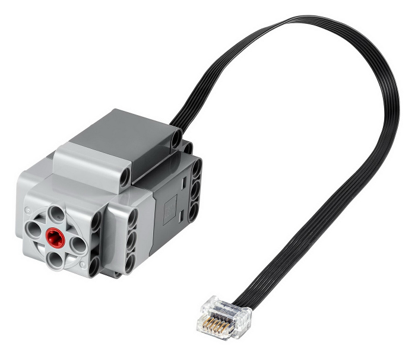
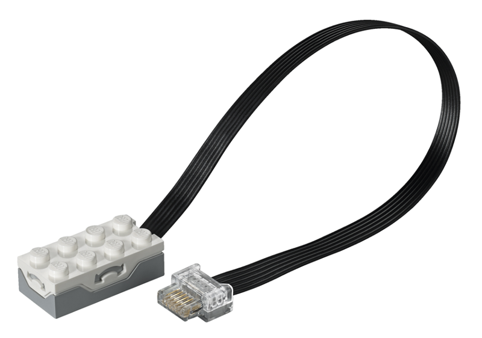
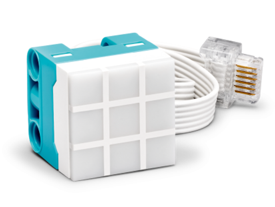
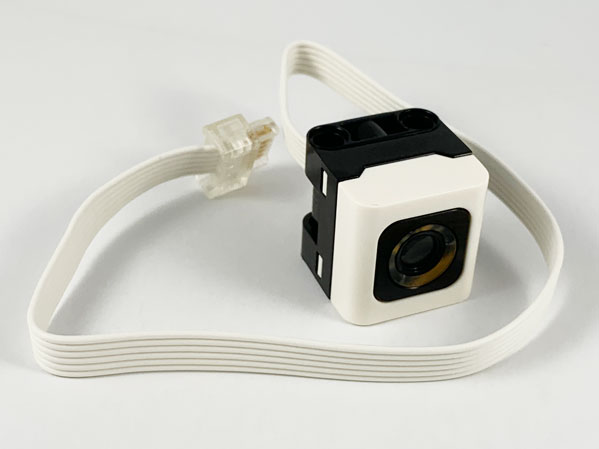

# Raspberry Pi Build HAT

The [Raspberry Pi Build HAT](https://raspberrypi.com/products/build-hat) is an add-on board that connects to the 40-pin GPIO header of your Raspberry Pi, which was designed in collaboration with LEGO® Education to make it easy to control LEGO® Technic™ motors and sensors with Raspberry Pi computers.

[](https://www.raspberrypi.com/documentation/accessories/build-hat.html#introducing-the-build-hat)

## Documentation

This binding used the following documentations:

- Raspberry Pi [Build HAT](https://www.raspberrypi.com/documentation/accessories/build-hat.htm) documentation.
- Raspberry Pi Build HAT [Serial Protocol](https://datasheets.raspberrypi.com/build-hat/build-hat-serial-protocol.pdf).
- Raspberry Pi Build HAT [official python library](https://datasheets.raspberrypi.com/build-hat/build-hat-python-library.pdf).
- [Powered Up serial link protocol](https://www.philohome.com/wedo2reverse/protocol.htm) from Philo.
- [Powered Up connector](https://www.philohome.com/wedo2reverse/connect.htm) from Philo.

## Known limitations

This implementation is based on those official documentation and reverse engineering. Not all motors or sensors have been tested.

Once booted, the Build HAT comes without any pre loaded firmware. This binding embeds a firmware and will upload this version of the firmware once connecting. The first initialization may take couple of seconds.

Even if this implementation try to get some compatibility with [BrickPi 3](../BrickPi3), the lower level implementation and the sensors work in a different way. Still, in general, the philosophy remains quite similar with a `Brick`, various Motors and Sensors.

## Usage

The main element is the Brick. It's the Build HAT itself. Note that Build HAT is based out of a Serial Port. So even if it takes the shape of a Raspberry Pi hat, it can actually perfectly work with anything having a serial port.

```csharp
// On a Raspberry PI, you'll use:
Brick brick = new("/dev/serial0");
```

On Windows you'll need an USB to Serial adapter, connect the TX pin from the adapter to the TX (physical pin 8, GPIO 14) pin from the hat. And the RX pin to the RX (physical pin 10, GPIO 15) pin. You then only need the ground connected on both side. It is important **not to** connect RX to TX as you may usually do.

```csharp
// On Windows, connected through a serial dongle and adjust the port number:
Brick brick = new("COM3");
```

Don't forget to dispose the brick at the end of your code. if you don't, your program won't stop.

```csharp
brick.Dispose();
```

If you want to avoid calling `Dispose` at the end, then create your brick with the `using` statement:

```csharp
// On a Raspberry PI, you'll use:
using Brick brick = new("/dev/serial0");
```

In this case, when reaching the end of the program, your brick will be automatically disposed.

### Displaying the information

You can gather the various versions, the signature and the input voltage:

```csharp
var info = brick.BuildHatInformation;
Console.WriteLine($"version: {info.Version}, firmware date: {info.FirmwareDate}, signature:");
Console.WriteLine($"{BitConverter.ToString(info.Signature)}");
Console.WriteLine($"Vin = {brick.InputVoltage.Volts} V");
```

Note: the input voltage is read only once at boot time and is not read after.

### Getting sensors and motors details

The functions `GetSensorType`, `GetSensor` will allow you to retrieve any information on connected sensor.

```csharp
SensorType sensor = brick.GetSensorType((SensorPort)i);
Console.Write($"Port: {i} {(Brick.IsMotor(sensor) ? "Sensor" : "Motor")} type: {sensor} Connected: ");
```

In this example, you can as well use the `IsMotor` static function to check if the connected element is a sensor or a motor.

```csharp
if (Brick.IsActiveSensor(sensor))
{
    ActiveSensor activeSensor = brick.GetActiveSensor((SensorPort)i);
}
else
{
    var passive = (Sensor)brick.GetSensor((SensorPort)i);
    Console.WriteLine(passive.IsConnected);
}
```

`ActiveSensor` have a collection of advanced properties and functions allowing to understand every element of the sensor. It is also possible to call the primitive functions from the brick from them. This will allow you to select specific modes and do advance scenarios. While this is possible, motor and sensor classes have been created to make your life easier.

### Events

Most sensors implements events on their special properties. You can simply subscribe to `PropertyChanged` and `PropertyUpdated`. The changed one will be fired when the value is changing while the updated one when there is a success update to the property. Depending on the modes used, some properties may be updated in the background all the time while some others occasionally.

You may be interested only when a color is changing or the position of the motor is changing, using it as a tachometer. In this case, the `PropertyChanged` is what you need!

```csharp
Console.WriteLine("Move motor on Port A to more than position 100 to stop this test.");
brick.WaitForSensorToConnect(SensorPort.PortA);
var active = (ActiveMotor)brick.GetMotor(SensorPort.PortA);
bool continueToRun = true;
active.PropertyChanged += MotorPropertyEvent;
while (continueToRun)
{
    Thread.Sleep(50);
}

active.PropertyChanged -= MotorPropertyEvent;
Console.WriteLine($"Current position: {active.Position}, eventing stopped.");

void MotorPropertyEvent(object? sender, PropertyChangedEventArgs e)
{
    Console.WriteLine($"Property changed: {e.PropertyName}");
    if (e.PropertyName == nameof(ActiveMotor.Position))
    {
        if (((ActiveMotor)brick.GetMotor(SensorPort.PortA)).Position > 100)
        {
            continueToRun = false;
        }
    }
}
```

### Waiting for initialization

The brick can take long before it does initialize. A wait for sensor to be connected has been implemented. You can use it like this:

```csharp
brick.WaitForSensorToConnect(SensorPort.PortB);
```

It does as well take a `CancellationToken` if you want to implement advance features like warning the user after some time and retrying.

### Motors

There are 2 types of motors, the *active* ones and the *passive* ones. Active motors will provide detailed position, absolute position and speed while passive motors can only be controlled with speed.

A common set of functions to control the speed of the motors are available. There are 2 important ones: `SetPowerLimit` and `SetBias`:

```csharp
train.SetPowerLimit(1.0);
train.SetBias(0.2);
```

The accepted values are only from 0.0 to 1.0. The power limit is a convenient ay to reduce in proportion the maximum power.

The bias value sets for the current port which is added to positive motor drive values and subtracted from negative motor drive values. This can be used to compensate for the fact that most DC motors require a certain amount of drive before they will turn at all.

The default values when a motor is created is 0.7 for the power limit and 0.3 for the bias.

### Passive Motors

[](https://www.bricklink.com/v2/catalog/catalogitem.page?S=88011-1&name=Train%20Motor&category=%5BPower%20Functions%5D%5BPowered%20Up%5D#T=S&O={%22iconly%22:0})

The typical passive motor is a train and older Powered Up motors. The `Speed` property can be set and read. It is the target and the measured speed at the same time as those sensors do not have a way to measure them. The value is from -100 to +100.

Functions to control `Start`, `Stop` and `SetSpeed` are also available. Here is a example of how to use it:

```csharp
Console.WriteLine("This will run the motor for 20 secondes incrementing the PWM");
train.SetPowerLimit(1.0);
train.Start();
for (int i = 0; i < 100; i++)
{
    train.SetSpeed(i);
    Thread.Sleep(250);
}

Console.WriteLine("Stop the train for 2 seconds");
train.Stop();
Thread.Sleep(2000);
Console.WriteLine("Full speed backward for 2 seconds");
train.Start(-100);
Thread.Sleep(2000);
Console.WriteLine("Full speed forward for 2 seconds");
train.Start(100);
Thread.Sleep(2000);
Console.WriteLine("Stop the train");
train.Stop();
```

Note: once the train is started, you can adjust the speed and the motor will adjust accordingly.

### Active Motors

[](https://www.bricklink.com/v2/catalog/catalogitem.page?S=88014-1&name=Technic%20XL%20Motor&category=%5BPower%20Functions%5D%5BPowered%20Up%5D#T=S&O={%22iconly%22:0})

Active motors have `Speed`, `AbsolutePosition`, `Position` and `TargetSpeed` as special properties. They are read continuously even when the motor is stopped.

The code snippet shows how to get the motors, start them and read the properties:

```csharp
brick.WaitForSensorToConnect(SensorPort.PortA);
brick.WaitForSensorToConnect(SensorPort.PortD);
var active = (ActiveMotor)brick.GetMotor(SensorPort.PortA);
var active2 = (ActiveMotor)brick.GetMotor(SensorPort.PortD);
active.Start(50);
active2.Start(50);
// Make sure you have an active motor plug in the port A and D
while (!Console.KeyAvailable)
{
    Console.CursorTop = 1;
    Console.CursorLeft = 0;
    Console.WriteLine($"Absolute: {active.AbsolutePosition}     ");
    Console.WriteLine($"Position: {active.Position}     ");
    Console.WriteLine($"Speed: {active.Speed}     ");
    Console.WriteLine();
    Console.WriteLine($"Absolute: {active2.AbsolutePosition}     ");
    Console.WriteLine($"Position: {active2.Position}     ");
    Console.WriteLine($"Speed: {active2.Speed}     ");
}

active.Stop();
active2.Stop();
```

Note: don't forget to start and stop your motors when needed.

Advance features are available for active motors. You can request to move for seconds, to a specific position, a specific absolute position. Here are couple of examples:

```csharp
// From the previous example, this will turn the motors back to their initial position:
active.TargetSpeed = 100;
active2.TargetSpeed = 100;
// First this motor and will block the thread
active.MoveToPosition(0, true);
// Then this one and will also block the thread
active2.MoveToPosition(0, true);
```

Each function allow you to block or not the thread for the time the operation will be performed. Note that for absolute and relative position moves, there is a tolerance of few degrees.

```csharp
brick.WaitForSensorToConnect(SensorPort.PortA);
var active = (ActiveMotor)brick.GetMotor(SensorPort.PortA);
active.TargetSpeed = 70;
Console.WriteLine("Moving motor to position 0");
active.MoveToPosition(0, true);
Console.WriteLine("Moving motor to position 3600 (10 turns)");
active.MoveToPosition(3600, true);
Console.WriteLine("Moving motor to position -3600 (so 20 turns the other way");
active.MoveToPosition(-3600, true);
Console.WriteLine("Moving motor to absolute position 0, should rotate by 90°");
active.MoveToAbsolutePosition(0, PositionWay.Shortest, true);
Console.WriteLine("Moving motor to position 90");
active.MoveToAbsolutePosition(90, PositionWay.Shortest, true);
Console.WriteLine("Moving motor to position 179");
active.MoveToAbsolutePosition(179, PositionWay.Shortest, true);
Console.WriteLine("Moving motor to position -180");
active.MoveToAbsolutePosition(-180, PositionWay.Shortest, true);
active.Float();
```

You can place the motor in a float position, meaning, there are no more constrains on it. This is a mode that you can use when using the motor as a tachometer, moving it and reading the position. If you still have constrains on the motors, you may not be able to move it.

### Sensors

Like for motors, you have active and passive sensors. Most recent sensors are active. The passive one are lights and simple buttons. Active ones are distance, color sensors as well as small 3x3 pixel displays.

#### Button/Touch Passive Sensor

The button/touch passive sensor have one specific property `IsPressed`. The property is set to true when the button is pressed. Here is a complete example with events:

```csharp
brick.WaitForSensorToConnect(SensorPort.PortA);
var button = (ButtonSensor)brick.GetSensor(SensorPort.PortA);
bool continueToRun = true;
button.PropertyChanged += ButtonPropertyEvent;
while (continueToRun)
{
    // You can do many other things here
    Thread.Sleep(50);
}

button.PropertyChanged -= ButtonPropertyEvent;
Console.WriteLine($"Button has been pressed, we're stopping the program.");
brick.Dispose();

void ButtonPropertyEvent(object? sender, PropertyChangedEventArgs e)
{
    Console.WriteLine($"Property changed: {e.PropertyName}");
    if (e.PropertyName == nameof(ButtonSensor.IsPressed))
    {
        continueToRun = false;
    }
}
```

### Passive Light

[](https://www.bricklink.com/v2/catalog/catalogitem.page?P=22168c01&name=Electric,%20Light%20Unit%20Powered%20Up%20Attachment&category=%5BElectric,%20Light%20&%20Sound%5D#T=C&C=11)

The passive light are the train lights. They can be switched on and you can controlled their brightness.

```csharp
brick.WaitForSensorToConnect(SensorPort.PortA);
var light = (PassiveLight)brick.GetSensor(SensorPort.PortA);
// Brightness 50%
light.On(50);
Thread.Sleep(2000);
// 70% Brightness
light.Brightness = 70;
Thread.Sleep(2000);
// Switch light off
light.Off()
```

### Active Sensor

The active sensor class is a generic one that all the active sensor heritate including active motors. They contains a set of properties regarding how they are connected to the Build HAT, the modes, the detailed combi modes, the hardware, software versions and a specific property called `ValueAsString`. The value as string contains the last measurement as a collection of strings. A measurement arrives like `P0C0: +23 -42 0`, the enumeration will contains `P0C0:`, `+23`, `-42` and `0`. This is made so if you are using advance modes and managing yourself the combi modes and commands, you'll be able to get the measurements.

All active sensor can run a specific measurement mode or a combi mode. You can setup one through the advance mode using the `SelectModeAndRead` and `SelectCombiModesAndRead` functions with the specific mode(s) you'd like to continuously have. It is important to understand that changing the mode or setting up a new mode will stop the previous mode.

The modes that can be combined in the Combi mode are listed in the `CombiModes` property. Al the properties of the sensors will be updated automatically when you'll setup one of those modes.

### WeDo Tilt Sensor

[](https://www.bricklink.com/v2/catalog/catalogitem.page?S=45305-1&name=WeDo%202.0%20Tilt%20Sensor&category=%5BEducational%20&%20Dacta%5D%5BWeDo%5D#T=S&O={%22iconly%22:0})

WeDo Tilt Sensor has a special `Tilt` property. The type is a point with X is the X tilt and Y is the Y tilt. The values goes from -45 to + 45, they are caped to those values and represent degrees.

You can set a continuous measurement for this sensor using the `ContinuousMeasurement` property.

```csharp
brick.WaitForSensorToConnect(SensorPort.PortA);
var tilt = (WeDoTiltSensor)brick.GetSensor(SensorPort.PortA);
tilt.ContinuousMeasurement = true;
Point tiltValue;
while(!console.KeyAvailable)
{
    tiltValue = tilt.Tilt;
    console.WriteLine($"Tilt X: {tiltValue.X}, Tilt Y: {tiltValue.Y}");
    Thread.Sleep(200);
}
```

### WeDoDistance Sensor

[](https://www.bricklink.com/v2/catalog/catalogitem.page?S=45304-1&name=WeDo%202.0%20Motion%20Sensor&category=%5BEducational%20&%20Dacta%5D%5BWeDo%5D#T=S&O={%22iconly%22:0})

WeDo Distance Sensor gives you a distance in millimeters with the Distance property.

```csharp
brick.WaitForSensorToConnect(SensorPort.PortA);
var distance = (WeDoDistanceSensor)brick.GetSensor(SensorPort.PortA);
distance.ContinuousMeasurement = true;
while(!console.KeyAvailable)
{    
    console.WriteLine($"Distance: {distance.Distance} mm");
    Thread.Sleep(200);
}
```

### SPIKE Prime Force Sensor

[](https://www.bricklink.com/v2/catalog/catalogitem.page?P=37312c01&name=Electric%20Sensor,%20Force%20-%20Spike%20Prime&category=%5BElectric%5D#T=C&C=11)

This force sensor measure the pressure applies on it and if it is pressed. The two properties can be access through `Force` and `IsPressed` properties.

```csharp
brick.WaitForSensorToConnect(SensorPort.PortA);
var force = (ForceSensor)brick.GetSensor(SensorPort.PortA);
force.ContinuousMeasurement = true;
while(!force.IsPressed)
{    
    console.WriteLine($"Force: {force.Force} N");
    Thread.Sleep(200);
}
```

### SPIKE Essential 3x3 Color Light Matrix

[](https://www.bricklink.com/v2/catalog/catalogitem.page?P=45608c01&name=Electric,%203%20x%203%20Color%20Light%20Matrix%20-%20SPIKE%20Prime&category=%5BElectric%5D#T=C)

This is a small 3x3 display with 9 different leds that can be controlled individually. The class exposes functions to be able to control the screen. Here is an example using them:

```csharp
brick.WaitForSensorToConnect(SensorPort.PortA);
var matrix = (ColorLightMatrix)brick.GetSensor(SensorPort.PortA);
for(byte i = 0; i < 10; i++)
{
    // Will light every led one after the other like a progress bar
    matrix.DisplayProgressBar(i);
    Thread.Sleep(1000);
}

for(byte i = 0; i < 11; i++)
{
    // Will display the matrix with the same color and go through all of them
    matrix.DisplayColor((LedColor)i);
    Thread.Sleep(1000);
}

Span<byte> brg = stackalloc byte[9] { 1, 2, 3, 4, 5, 6, 7, 8, 9 };
Span<LedColor> col = stackalloc LedColor[9] { LedColor.White, LedColor.White, LedColor.White,
  LedColor.White, LedColor.White, LedColor.White, LedColor.White, LedColor.White, LedColor.White };
// Shades of grey
matrix.DisplayColorPerPixel(brg, col);
```

### SPIKE Prime Color Sensor and Color and Distance Sensor

SPIKE color sensor:

[](https://www.bricklink.com/v2/catalog/catalogitem.page?P=37308c01&name=Electric%20Sensor,%20Color%20-%20Spike%20Prime&category=%5BElectric%5D#T=C&C=11)

Color and distance sensor:

[](https://www.bricklink.com/v2/catalog/catalogitem.page?P=bb0891c01&name=Electric%20Sensor,%20Color%20and%20Distance%20-%20Boost&category=%5BElectric%5D#T=C&C=1)

Those color sensor has multiple properties and functions. You can get the `Color`, the `ReflectedLight` and the `AmbiantLight`.

On top of this, the Color and Distance sensor can measure the `Distance` and has an object `Counter`. It will count automatically the number of objects which will go in and out of the range. This does allow to count objects passing in front of the sensor. The distance is limited from 0 to 10 centimeters.

```csharp
brick.WaitForSensorToConnect(SensorPort.PortC);

var colorSensor = (ColorAndDistanceSensor)brick.GetActiveSensor(SensorPort.PortC);
while (!Console.KeyAvailable)
{
    var colorRead = colorSensor.GetColor();
    Console.WriteLine($"Color:     {colorRead}");
    var relected = colorSensor.GetReflectedLight();
    Console.WriteLine($"Reflected: {relected}");
    var ambiant = colorSensor.GetAmbiantLight();
    Console.WriteLine($"Ambiant:   {ambiant}");
    var distance = colorSensor.GetDistance();
    Console.WriteLine($"Distance: {distance}");
    var counter = colorSensor.GetCounter();
    Console.WriteLine($"Counter:  {counter}");
    Thread.Sleep(200);
}
```

Note: for better measurement, it is not recommended to change the measurement mode in a very fast way, the color integration may not be done in a proper way. This example gives you the full spectrum of what you can do with the sensor. Also, this class do not implement a continuous measurement mode. You can setup one through the advance mode using the `SelectModeAndRead` function with the specific mode you'd like to continuously have. It is important to understand that changing the mode or setting up a new mode will stop the previous mode.

### SPIKE Prime Ultrasonic Distance Sensor

[](https://www.bricklink.com/v2/catalog/catalogitem.page?P=37316c01&name=Electric%20Sensor,%20Distance%20-%20Spike%20Prime&category=%5BElectric%5D#T=C&C=11)

This is a distance sensor and it does implement a `Distance` property that will give the distance in millimeter. A `ContinuousMeasurement` mode is also available on this one.

```csharp
brick.WaitForSensorToConnect(SensorPort.PortA);
var distance = (DistanceSensor)brick.GetSensor(SensorPort.PortA);
distance.ContinuousMeasurement = true;
while(!console.KeyAvailable)
{    
    console.WriteLine($"Distance: {distance.Distance} mm");
    Thread.Sleep(200);
}
```
