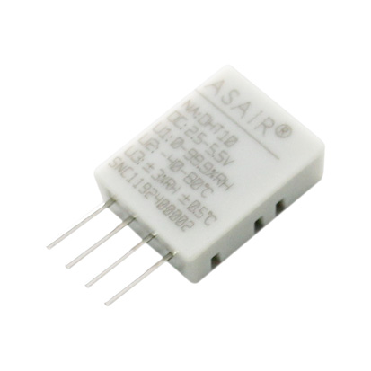
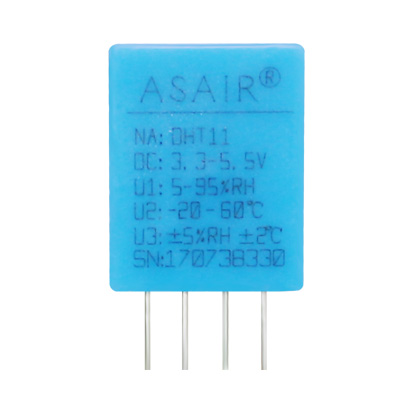
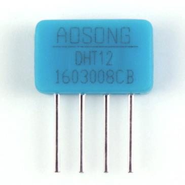
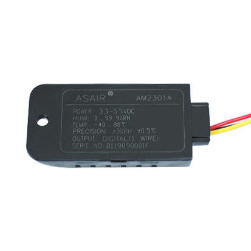
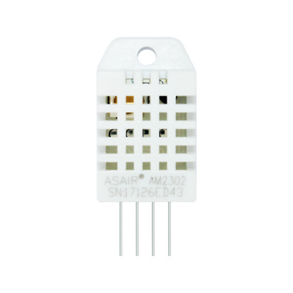
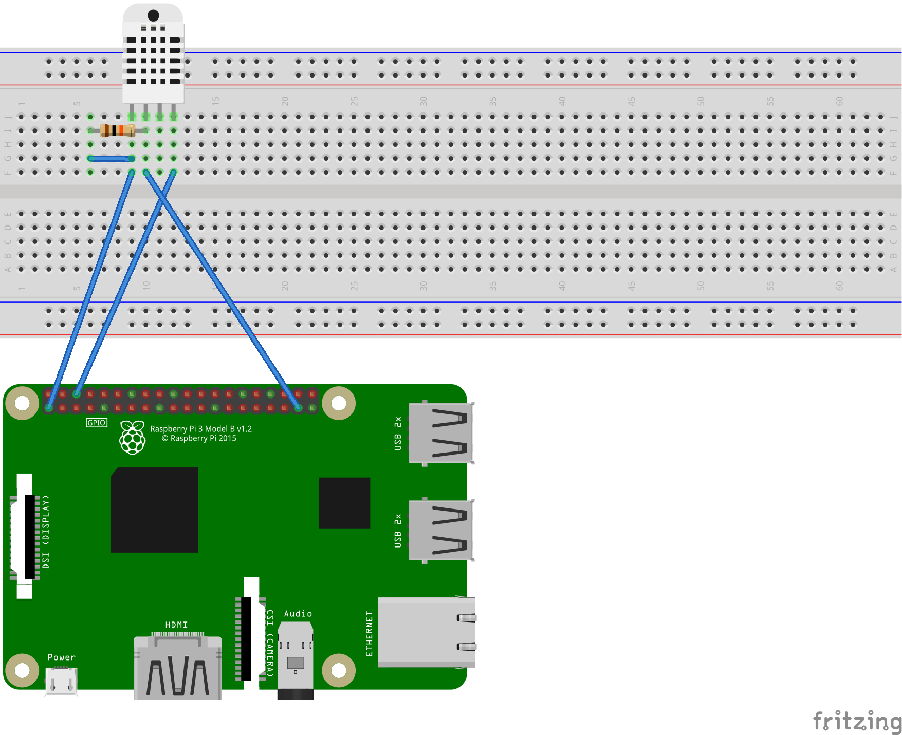

# DHTxx - Digital-Output Relative Humidity & Temperature Sensor Module

The DHT temperature and humidity sensors are very popular. This projects support DHT10, DHT11, DHT12, DHT21(AM2301), DHT22(AM2302).

## Documentation

|  | DHT10 | DHT11 | DHT12 | DHT21 | DHT22 |
| :------: | :------: | :------: | :------: | :------: | :------: |
| Image |  |  |  |  |  |
| Temperature Range | -40 ~ 80 ℃ | 0 ~ 60 ℃ | -20 ~ 60 ℃ | -40 ~ 80 ℃ | -40 ~ 80 ℃ |
| Humidity Range | 0 ~ 99.9 % | 2 ~ 95 % | 20 ~ 95 % | 0 ~ 99.9 % | 0 ~ 99.9 % |
| Temperature Accuracy | ±0.5 ℃ | ±2 ℃ | ±0.5 ℃ | ±0.5 ℃ | ±0.5 ℃ |
| Humidity Accuracy | ±3 % | ±5 % | ±4 % | ±3 % | ±2 % |
| Protocol | I2C | 1-Wire | I2C, 1-Wire | 1-Wire | 1-Wire |

* **DHT10** [datasheet (Currently only Chinese)](http://www.aosong.com/userfiles/files/media/DHT10%E8%A7%84%E6%A0%BC%E4%B9%A6.pdf)
* **DHT11** [datasheet](https://cdn.datasheetspdf.com/pdf-down/D/H/T/DHT11-Aosong.pdf)
* **DHT12** [datasheet](https://cdn.datasheetspdf.com/pdf-down/D/H/T/DHT12-Aosong.pdf)
* **DHT21** [datasheet](https://cdn.datasheetspdf.com/pdf-down/A/M/2/AM2301-Aosong.pdf)
* **DHT22** [datasheet](https://cdn-shop.adafruit.com/datasheets/DHT22.pdf)

## Usage

### 1-Wire Protocol

```csharp
// GPIO Pin
using (Dht11 dht = new Dht11(26))
{
    var temperature = dht.Temperature;
    var humidity = dht.Humidity;
    // You can only display temperature and humidity if the read is successful otherwise, this will raise an exception as
    // both temperature and humidity are NAN
    if (dht.IsLastReadSuccessful)
    {
        Console.WriteLine($"Temperature: {temperature.DegreesCelsius} \u00B0C, Humidity: {humidity.Percent} %");

        // WeatherHelper supports more calculations, such as saturated vapor pressure, actual vapor pressure and absolute humidity.
        Console.WriteLine(
            $"Heat index: {WeatherHelper.CalculateHeatIndex(temperature, humidity).Celsius:0.#}\u00B0C");
        Console.WriteLine(
            $"Dew point: {WeatherHelper.CalculateDewPoint(temperature, humidity).Celsius:0.#}\u00B0C");
    }
    else
    {
        Console.WriteLine("Error reading DHT sensor");
    }
}
```

**Note:** _On the RPi with any of the DHT sensor, 1-Wire works using Raspian but not with Windows 10 IoT Core. The device has to switch the 1-wire pin between input and output and vice versa. It seems that Windows IoT Core OS can't switch the pin direction quick enough. There have been suggestions for using two pins; one for input and one for output. This solution has not been implemented here, but these are some handy links that may help setting that up:_

* <https://github.com/ms-iot/samples/tree/develop/GpioOneWire>
* And on Hackster.io: <https://www.hackster.io/porrey/go-native-c-with-the-dht22-a8e8eb>

### I2C Protocol

Only DHT12 can use I2C protocol.

```csharp
I2cConnectionSettings settings = new I2cConnectionSettings(1, DhtSensor.DefaultI2cAddressDht12);
I2cDevice device = I2cDevice.Create(settings);

using (Dht12 dht = new Dht12(device))
{
    var tempValue = dht.Temperature;
    var humValue = dht.Humidity;
    if (dht.IsLastReadSuccessful)
    {
        Console.WriteLine($"Temperature: {tempValue.Celsius:0.#}\u00B0C");
        Console.WriteLine($"Relative humidity: {humValue:0.#}%");

        // WeatherHelper supports more calculations, such as saturated vapor pressure, actual vapor pressure and absolute humidity.
        Console.WriteLine(
            $"Heat index: {WeatherHelper.CalculateHeatIndex(tempValue, humValue).Celsius:0.#}\u00B0C");
        Console.WriteLine(
            $"Dew point: {WeatherHelper.CalculateDewPoint(tempValue, humValue).Celsius:0.#}\u00B0C");
    }
    else
    {
        Console.WriteLine("Error reading DHT sensor");
    }
}
```

## Reading frequency and quality measurement

In the case of I2C or GPIO, any type of DHT needs a bit of time between 2 readings. DHT22 documentation refer to a sensing period of 2 seconds and a collecting period higher than 1.7 seconds.
Measuring with higher frequency won't give you more accurate numbers. As you can see from the specifications, the accuracy depends on the sensor type, it goes from ±2 ℃ for the DHT11 to ±0.5 ℃ for the others.
Even if the parity check can come clear, we do recommend to check that the data are in a normal range. For example of humidity is higher than 100%, then it means that measurement is wrong.
This check has not been done in the binding itself, so you may consider adding a check on your application side.

The DHT sensors are very sensitive, avoid too long cables, electromagnetic perturbations and compile the code as release not debug to increase the quality of measurement.

## FAQ

### I always get wrong measurements, what's happening?

Please check that the sensor is plugged correctly, make sure you are using the correct pin.

Please check you are using the correct sensor, only DHT10 and DHT12 supports I2C. All others support only GPIO with 1 wire protocol. DHT12 supports both.

### The data I measure are not correct, humidity seems ok but temperature is always weird, what's the problem?

Please check you are using the correct sensor. Refer to the top part of this page to check which sensor you have. Using a DHT11 instead of a DHT22 will give you a wrong temperature.

### I am trying to get a temperature and humidity 5 times per seconds but I mainly get wrong measurements, why?

This is absolutely normal, you should check the measurements once every 2 seconds approximately. Don't try to get more measures than once every 2 seconds.

### When reading the temperature and humidity and trying to write the data in the console, I get an exception, why?

You need to check first if the measurement has been successful. If the measurement hasn't been successful, the default values will be NaN and so you won't be able to convert the temperature or humidity and you'll get an exception. This is the correct way of first reading the sensor and then checking the reading was correct and finally using the temperature and humidity data:

```csharp
var tempValue = dht.Temperature;
var humValue = dht.Humidity;
if (dht.IsLastReadSuccessful)
{
    Console.WriteLine($"Temperature: {tempValue.Celsius:0.#}\u00B0C");
    Console.WriteLine($"Relative humidity: {humValue:0.#}%");
}
```

### I have a Raspberry Pi 4 and I get an exception when creating the DHT sensor

See this [issue 1145](https://github.com/dotnet/iot/issues/1145). We're actively trying to fix it automatically. You will have to force using either the Raspberry Pi 3 driver, either the LibGpiodDriver. This is how you can force using a specific drive, in this case the Raspberry Pi 3 one which will work:

```csharp
GpioDriver driver = new RaspberryPi3Driver();
var controller = new GpioController(PinNumberingScheme.Logical, driver);
// This uses pin 4 in the logical schema so pin 7 in the physical schema
var dht = new Dht11(4, gpioController: controller);
```

### My DHT sensor using 1 wire protocol is not working on my Raspberry Pi with Windows 10 IoT Core, what can I do?

On the RPi with any of the DHT sensor, 1-Wire works using Raspian but not with Windows 10 IoT Core. The device has to switch the 1-wire pin between input and output and vice versa. It seems that Windows IoT Core OS can't switch the pin direction quick enough. There have been suggestions for using two pins; one for input and one for output. This solution has not been implemented here, but these are some handy links that may help setting that up:_

* <https://github.com/ms-iot/samples/tree/develop/GpioOneWire>
* And on Hackster.io: <https://www.hackster.io/porrey/go-native-c-with-the-dht22-a8e8eb>

Now if your sensor is an I2C sensor, it should just work perfectly on Windows 10 IoT Core.

## Example of DHTxx

### Hardware Required

* DHT10/DHT11/DHT12/DHT21/DHT22
* Male/Female Jumper Wires

### Circuit

#### 1-Wire Protocol Circuit

Simply connect your DHTxx data pin to GPIO26 (physical pin 37), the ground to the ground (physical pin 6) and the VCC to +5V (physical pin 2).



Some sensors are already sold with the 10K resistor. Connect the GPIO26 to the _data_ pin, its position can vary depending on the integrator.

#### I2C Protocol Circuit


* SCL - SCL
* SDA - SDA
* VCC - 5V
* GND - GND

### Code

```csharp
// GPIO Pin
using (Dht11 dht = new Dht11(26))
{
    var temperature = dht.Temperature;
    var humidity = dht.Humidity;
    // You can only display temperature and humidity if the read is successful otherwise, this will raise an exception as
    // both temperature and humidity are NAN
    if (dht.IsLastReadSuccessful)
    {
        Console.WriteLine($"Temperature: {temperature.DegreesCelsius} \u00B0C, Humidity: {humidity.Percent} %");

        // WeatherHelper supports more calculations, such as saturated vapor pressure, actual vapor pressure and absolute humidity.
        Console.WriteLine(
            $"Heat index: {WeatherHelper.CalculateHeatIndex(temperature, humidity).Celsius:0.#}\u00B0C");
        Console.WriteLine(
            $"Dew point: {WeatherHelper.CalculateDewPoint(temperature, humidity).Celsius:0.#}\u00B0C");
    }
    else
    {
        Console.WriteLine("Error reading DHT sensor");
    }
}
```

### Sample application navigation

This sample application allows you to select either a DHT10 through I2C either any other supported DHT through GPIO:

```text
Select the DHT sensor you want to use:
 1. DHT10 on I2C
 2. DHT11 on GPIO
 3. DHT12 on GPIO
 4. DHT21 on GPIO
 5. DHT22 on GPIO
```

Just select the sensor you want to test and use by typing the number. For example, if you want to test a DHT22, type 5.

Then, you are prompted to type the pin number in the logical schema:

```text
Which pin do you want to use in the logical pin schema?
```

If you want to use the pin 26, then type 26 and enter. This will then create a DHT22 sensor attached to pin 26 and start the measurement.

Please note that the few first measurements won't be correct, that's totally normal and related to the fact the sensor needs a bit of time to warm up and give data. Those sensors are very sensitive and too long wires, many perturbations, code compile as debug will increase the numbers of bad readings.

### Result


Note: reading this sensor is sensitive, if you can't read anything, make sure you have it correctly cabled. Also note you'll get better results when running in ```Release``` mode.
