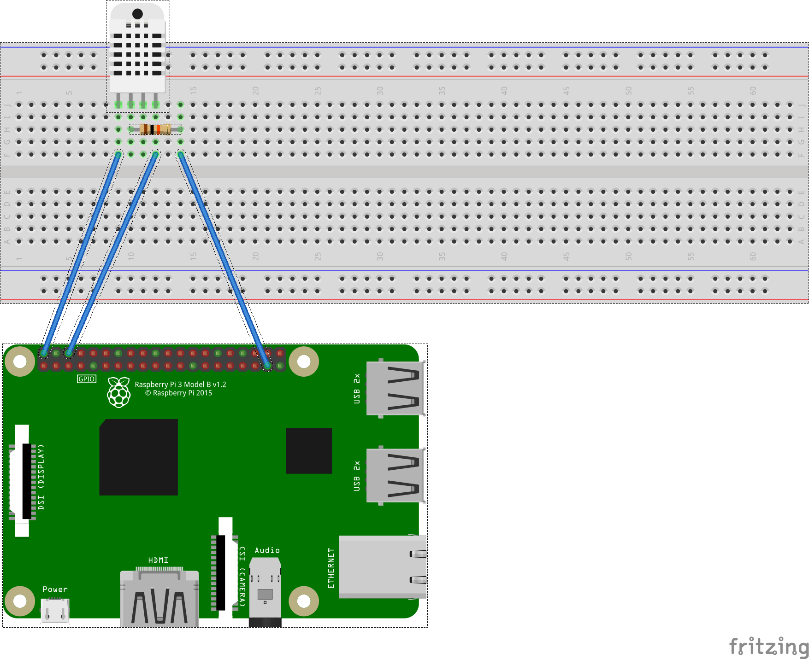

# Example of DHT22

## Schematic

Simply connect your DHT22 data pin to GPIO26 (physical pin 37), the ground to the ground (physical pin 6) and the VCC to +5V (physical pin 2).



Note: if you replace the DHT22 by a DHT11, the schema will be the same.

Some sensors are already sold with the 10K resistor. Connect the GPIO26 to the *data* pin, its position can vary depending on the integrator.

## Code

To initialize the sensor, you need to select a pin and the type of sensor, either DHT11 or DHT22.

```csharp
DHTSensor dht = new DHTSensor(26, DhtType.Dht22);
```

To get a temperature or a humidity value, you first need to read the sensor.

```csharp
bool readret = dht.ReadData();
```

Then you can read the temperature and humidity:

```csharp
if (readret)
{
    var temp = dht.Temperature;
    var hum = dht.Humidity;
}
```

Note: temperature is in Celsius and humidity is in relative percentage air humidity. So 100% will gives you a fully saturated air.

Here is a full example:

```csharp
using System;
using Iot.Device.DHTxx;
using System.Diagnostics;
using System.Device.Gpio;
using System.Threading;
class Program
{
    static void Main(string[] args)
    {
        Console.WriteLine("Hello DHT!");
        DHTSensor dht = new DHTSensor(26, DhtType.Dht22);
        while(true)
        {
            bool readret = dht.ReadData();
            if (readret)
                Console.WriteLine($"Temperature: {dht.Temperature.ToString("0.00")} °C, Humidity: {dht.Humidity.ToString("0.00")} %");
            else
                Console.WriteLine("Error reading the sensor");
            Thread.Sleep(1000);
        }
        
    }
}
```

As an output, if everything goes right, you will have something like:


Note: reading this sensor is sensitive, if you can't read anything, make sure you have it correctly cabled. Also note you'll get better results when running in ```Release``` mode.


