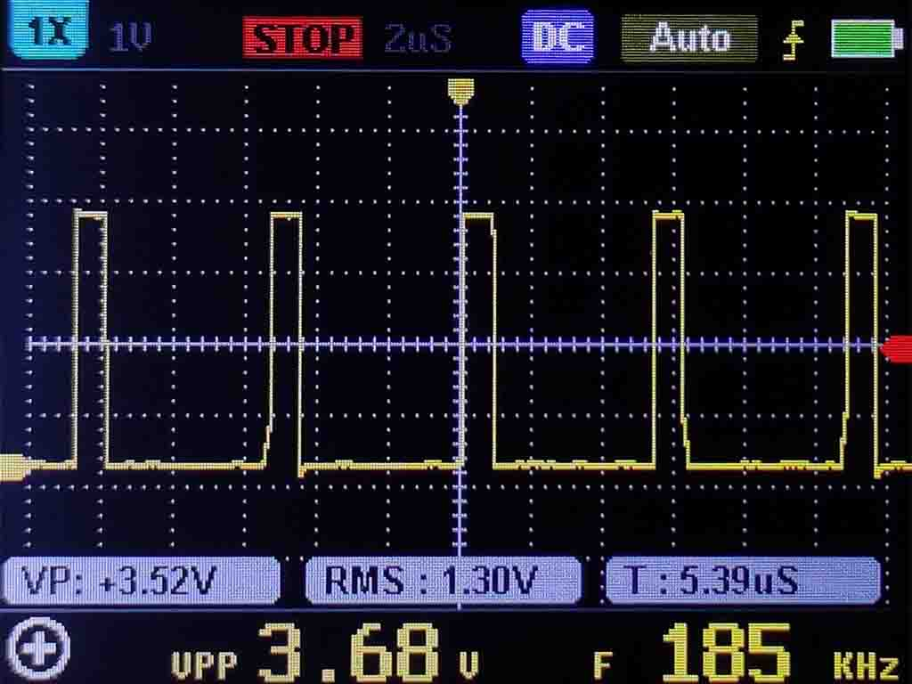
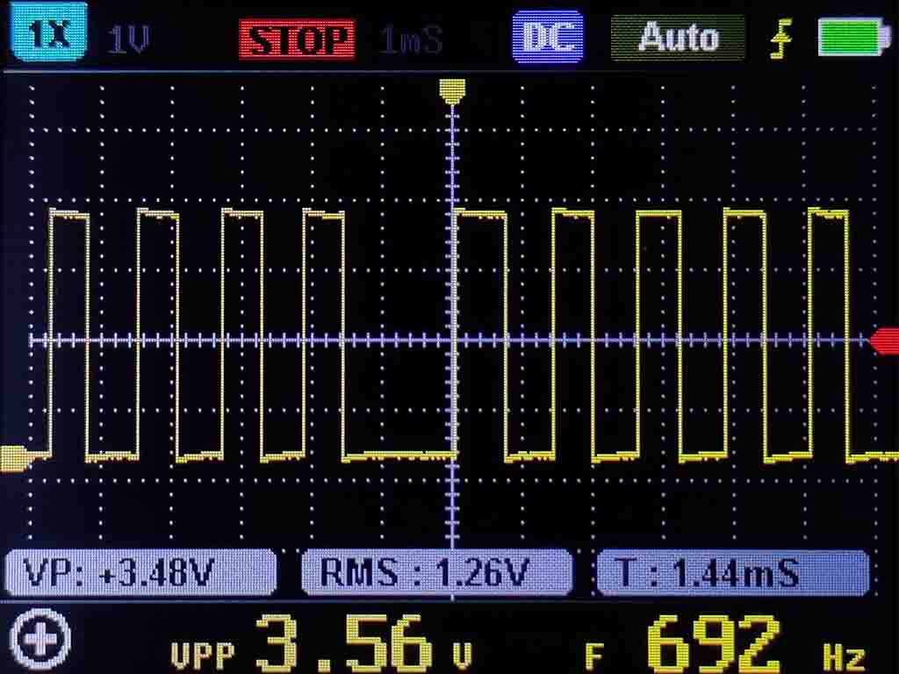
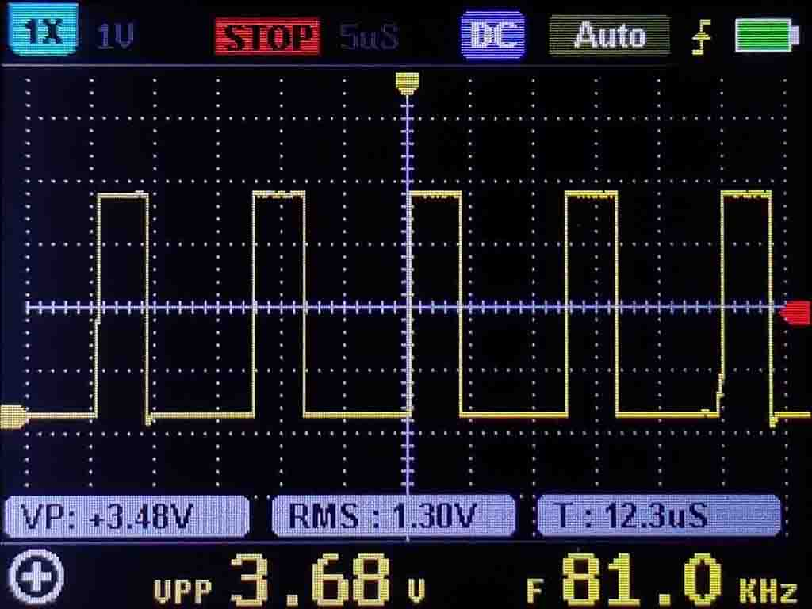
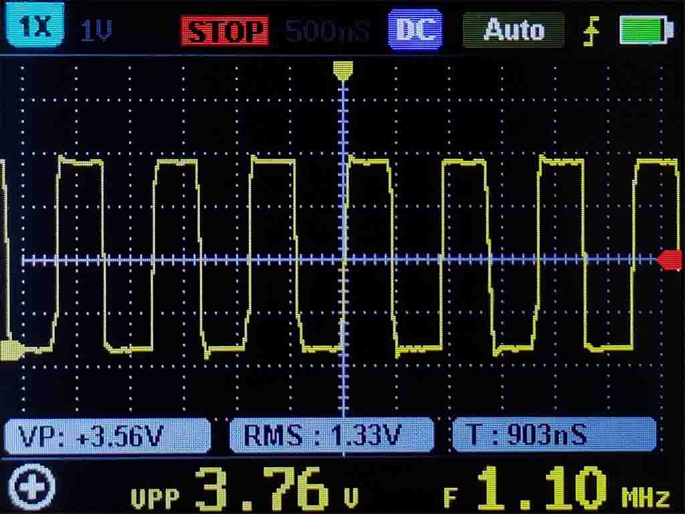
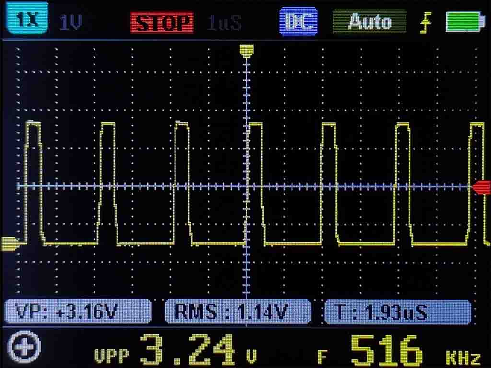
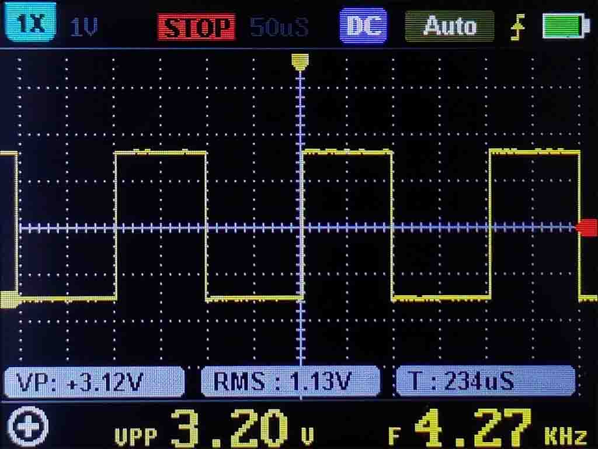
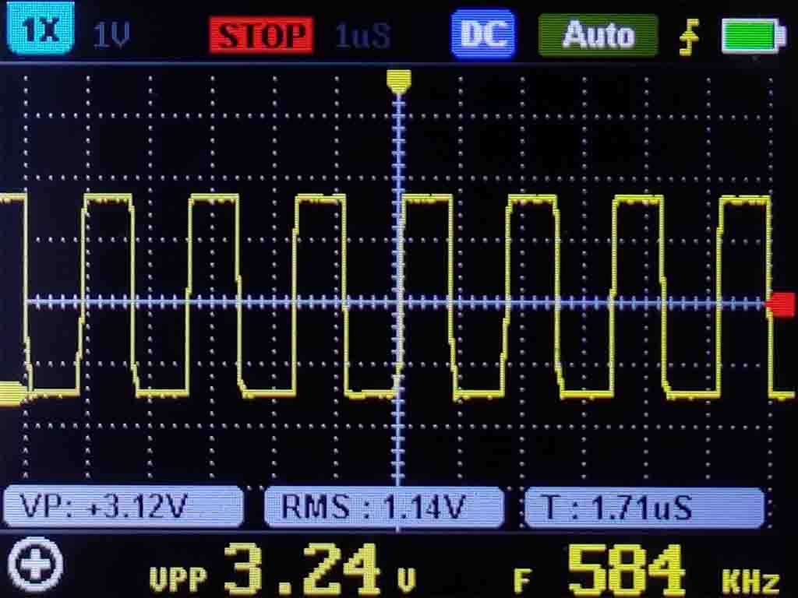

# GpioDriver for other boards

This project contains some **full function(PULL-UP, PULL-DOWN)** generic GPIO drivers, and it can provide faster GPIO access.

## Documentation

* For Allwinner SoCs: [SunxiDriver](Drivers/Sunxi/README.md)
* For Rockchip SoCs: [RockchipDriver](Drivers/Rockchip/README.md)

## Board specific drivers

| Board | Driver |
| :-: | :-: |
| Orange Pi 4 | OrangePi4Driver.cs |
| Orange Pi Lite | OrangePiLiteDriver.cs  |
| Orange Pi Lite 2 | OrangePiLite2Driver.cs |
| Orange Pi Zero | OrangePiZeroDriver.cs |
| Orange Pi Zero 2 | OrangePiZero2Driver.cs |
| Rock Pi 4B Plus | RockPi4bPlusDriver.cs |


## Benchmarks

The test uses different GPIO drivers to quickly switch the state of GPIO, and uses an oscilloscope to measure the average frequency of GPIO externally.

### SunxiDriver

Benchmarking with **Orange Pi Zero**, select GPIO 6 (Logical). The operating system is Armbian buster, Linux kernel version is 5.10.16, and .NET version is 5.0.3.

| Drivers| Language | Library Version | Test Date | Average Frequency |  |
| :-: | :-: | :-: | :-: | :-: | :-: |
| SunxiDriver | C# | - | 2020-02-20 | 185 KHz |  |
| SysFsDriver | C# | System.Device.Gpio 1.3.0 | 2020-02-20 | 692 Hz |  |
| LibGpiodDriver | C# | System.Device.Gpio 1.3.0 - libgpiod 1.2-3 | 2020-02-20 | 81 KHz |  |
| [wiringOP](https://github.com/orangepi-xunlong/wiringOP) | C | 35de015 | 2020-02-22 | 1.10 MHz |  |

### RockchipDriver

Benchmarking with **Orange Pi 4**, select GPIO 150 (Logical). The operating system is Armbian buster, Linux kernel version is 5.10.16, and .NET version is 5.0.3.

| Drivers| Language | Library Version | Test Date | Average Frequency |  |
| :-: | :-: | :-: | :-: | :-: | :-: |
| RockchipDriver | C# | - | 2020-02-22 | 516 KHz |  |
| SysFsDriver | C# | System.Device.Gpio 1.3.0 | 2020-02-22 | 4.27 KHz |  |
| LibGpiodDriver | C# | System.Device.Gpio 1.3.0 - libgpiod 1.2-3 | 2020-02-22 | 174 KHz |  |
| [wiringOP](https://github.com/orangepi-xunlong/wiringOP) | C | 35de015 | 2020-02-22 | 584 KHz |  |

## Usage

### Hardware required

* Orange Pi Zero
* Switch
* Male/Female Jumper Wires

### Circuit


* Switch 1 - Board Pin7 (GPIO 6)
* Switch 2 - GND

### Code

```csharp
using System;
using System.Device.Gpio;
using Iot.Device.BoardLed;
using Iot.Device.Gpio.Drivers;

// Set debounce delay to 5ms
int debounceDelay = 50000;
int pin = 7;

Console.WriteLine($"Let's blink an on-board LED!");

using GpioController controller = new GpioController(PinNumberingScheme.Board, new OrangePiZeroDriver());
using BoardLed led = new BoardLed("orangepi:red:status");

controller.OpenPin(pin, PinMode.InputPullUp);
led.Trigger = "none";
Console.WriteLine($"GPIO pin enabled for use: {pin}.");
Console.WriteLine("Press any key to exit.");

while (!Console.KeyAvailable)
{
    if (Debounce())
    {
        // Button is pressed
        led.Brightness = 1;
    }
    else
    {
        // Button is unpressed
        led.Brightness = 0;
    }
}

bool Debounce()
{
    long debounceTick = DateTime.Now.Ticks;
    PinValue buttonState = controller.Read(pin);

    do
    {
        PinValue currentState = controller.Read(pin);

        if (currentState != buttonState)
        {
            debounceTick = DateTime.Now.Ticks;
            buttonState = currentState;
        }
    }
    while (DateTime.Now.Ticks - debounceTick < debounceDelay);

    if (buttonState == PinValue.Low)
    {
        return true;
    }
    else
    {
        return false;
    }
}
```
