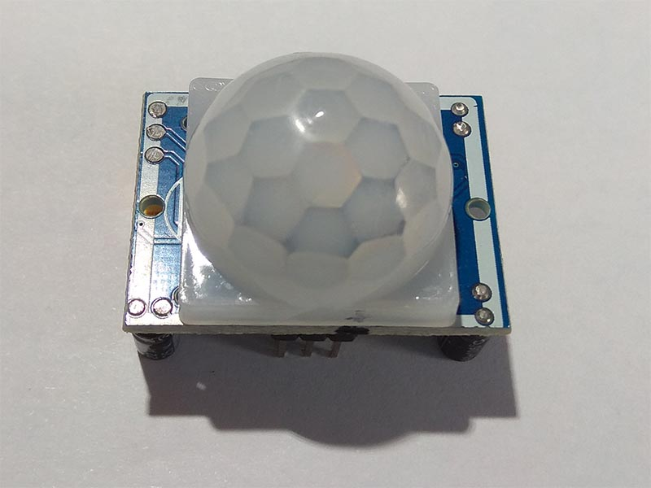

# HC-SR501 - PIR Motion Sensor

HC-SR501 is used to detect motion based on the infrared heat in the surrounding area. 

## Documentation

- In [Chinese](http://wenku.baidu.com/view/26ef5a9c49649b6648d747b2.html)
- In [English](https://cdn.datasheetspdf.com/pdf-down/H/C/-/HC-SR501-1-ETC.pdf)



## Usage

```C#
using(Hcsr501 sensor = new Hcsr501(hcsr501Pin, PinNumberingScheme.Logical))
{
    // detect motion
    bool isDetected = sensor.IsMotionDetected;
}
```

From the [HC-SR501 sample](https://github.com/dotnet/iot/tree/main/src/devices/Hcsr501/samples), we can do comething more complete:

```C#
GpioController ledController = new GpioController();
ledController.OpenPin(27, PinMode.Output);

using (Iot.Device.Hcsr501.Hcsr501 sensor =
    new Iot.Device.Hcsr501.Hcsr501(17))
{
    while (true)
    {
        // adjusting the detection distance and time by rotating the potentiometer on the sensor
        if (sensor.IsMotionDetected)
        {
            // turn the led on when the sensor detected infrared heat
            ledController.Write(27, PinValue.High);
            Console.WriteLine("Detected! Turn the LED on.");
        }
        else
        {
            // turn the led off when the sensor undetected infrared heat
            ledController.Write(27, PinValue.Low);
            Console.WriteLine("Undetected! Turn the LED off.");
        }

        Thread.Sleep(1000);
    }
}
```

### Hardware Required

* PIR Motion Sensor - HC-SR501
* LED
* 220 Ω resistor
* Male/Female Jumper Wires

### Circuit


### HC-SR501


* VCC - 5V
* GND - GND
* OUT - GPIO 17

### LED

* VCC & 220 Ω resistor - GPIO 27
* GND - GND

### Result


