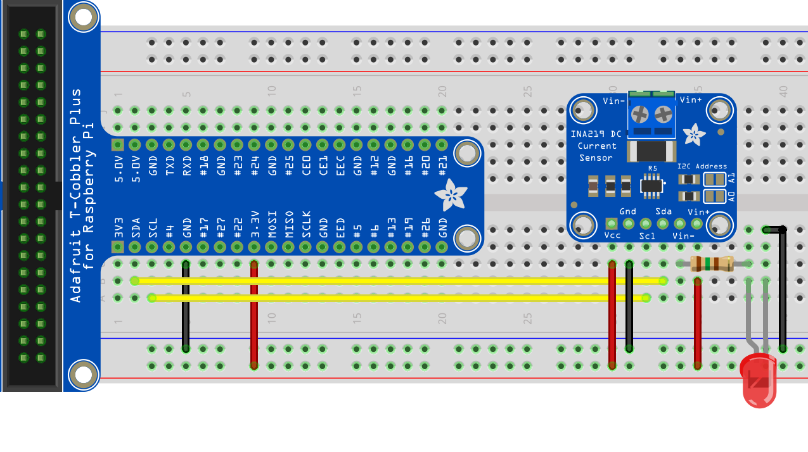

# INA219 Sample - Measuring the voltage current and power of a light emitting diode.

This sample uses an Adafruit INA219 breakout board and monitors a LED wired into the 3.3 volts supply with a 150 ohm current limiting resistor. It prints the bus voltage, shunt voltage, current and power every second.

The configuration and calibration is determinined as follows.

* The bus voltage range can be either 16v or 32v. As this example uses a 3.3v supply then the 16v bus voltage range is chosen
* The current through the LED is in the low tens of milliamps. If we take 50mA as a reasonable maximum current that we may want to see then the maximum voltage accross the shunt resistor is 0.1 Ohms x 50mA which works out
at 5mV. Given this we can use a shunt voltage range of +/- 40mV
* The maximum possible current would then be 40mV / 0.1 = 400mA
* With a 400mA maximum current and a range of the ADC of 15bits then the LSB of the current would be 400mA/32767 = 12.2207 microamps. We will chose 12.2uA as a round number.
* From the [INA219 Datasheet](http://www.ti.com/lit/ds/symlink/ina219.pdf) the calibration register should be set at 0.04096/(currentLSB * shunt resistance) = 33574 = 0x8326

    const byte Adafruit_Ina219_I2cAddress = 0x40;
    const byte Adafruit_Ina219_I2cBus = 0x1;

    // create an INA219 device on I2C bus 1 addressing channel 64
    using (Ina219 device = new Ina219(new I2cConnectionSettings(Adafruit_Ina219_I2cBus, Adafruit_Ina219_I2cAddress)))
    {
        // reset the device 
        device.Reset();

        // set up the bus and shunt voltage ranges and the calibration. Other values left at default.
        device.BusVoltageRange = Ina219BusVoltageRange.Range16v;
        device.PgaSensitivity = Ina219PgaSensitivity.PlusOrMinus40mv;
        device.SetCalibration(33574, (float)12.2e-6);

        while (true)
        {
            // write out the current values from the INA219 device.
            System.Console.WriteLine($"Bus Voltage {device.ReadBusVoltage()}V Shunt Voltage {device.ReadShuntVoltage() * 1000}mV Current {device.ReadCurrent() * 1000}mA Power {device.ReadPower() * 1000}mW");
            System.Threading.Thread.Sleep(1000);
        }
    }
