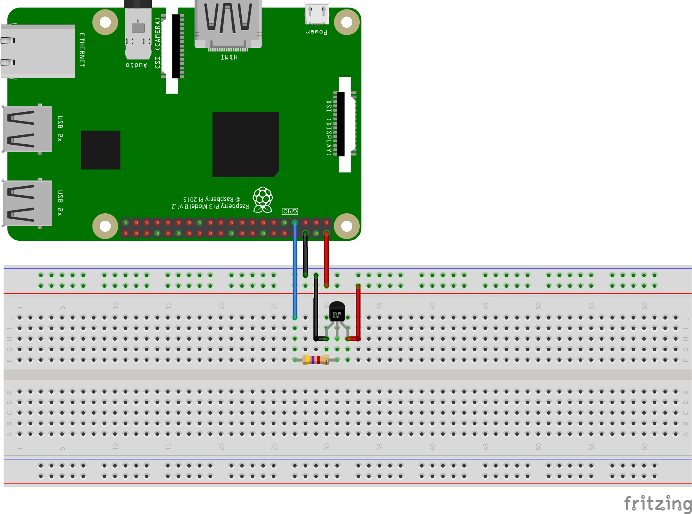

# 1-wire

Allows using 1-wire devices such as digital thermometers (i.e. MAX31820, DS18B20). See [sample](samples/README.md) for how to use.

## Documentation

- [dtoverlay](https://pinout.xyz/pinout/1_wire)

## Board

The following [fritzing diagram](onewire-temp.fzz) demonstrates how you should wire your device in order to run the program. It uses the GND, 5V and GPIO4 pins on the Raspberry Pi.



## Usage

```csharp
using System;
using System.Linq;
using System.Threading.Tasks;
using Iot.Device.OneWire;

// Make sure you can access the bus device before requesting a device scan (or run using sudo)
// $ sudo chmod a+rw /sys/bus/w1/devices/w1_bus_master1/w1_master_*
if (args.Any(_ => _ == "temp"))
{
    // Quick and simple way to find a thermometer and print the temperature
    foreach (var dev in OneWireThermometerDevice.EnumerateDevices())
    {
        Console.WriteLine($"Temperature reported by '{dev.DeviceId}': " +
                            (await dev.ReadTemperatureAsync()).DegreesCelsius.ToString("F2") + "\u00B0C");
    }
}
else
{
    // More advanced way, with rescanning the bus and iterating devices per 1-wire bus
    foreach (string busId in OneWireBus.EnumerateBusIds())
    {
        OneWireBus bus = new(busId);
        Console.WriteLine($"Found bus '{bus.BusId}', scanning for devices ...");
        await bus.ScanForDeviceChangesAsync();
        foreach (string devId in bus.EnumerateDeviceIds())
        {
            OneWireDevice dev = new(busId, devId);
            Console.WriteLine($"Found family '{dev.Family}' device '{dev.DeviceId}' on '{bus.BusId}'");
            if (OneWireThermometerDevice.IsCompatible(busId, devId))
            {
                OneWireThermometerDevice devTemp = new(busId, devId);
                Console.WriteLine("Temperature reported by device: " +
                                    (await devTemp.ReadTemperatureAsync()).DegreesCelsius.ToString("F2") +
                                    "\u00B0C");
            }
        }
    }
}
```

## How to setup 1-wire on Raspberry Pi

Add the following to `/boot/config.txt` to enable 1-wire protocol. The default gpio is 4 (pin 7).

    dtoverlay=w1-gpio

Add this to specify gpio 17 (pin 11).

    dtoverlay=w1-gpio,gpiopin=17

## Supported devices

All temperature devices with family id of 0x10, 0x28, 0x3B, or 0x42 supported.

* [MAX31820](https://datasheets.maximintegrated.com/en/ds/MAX31820.pdf)
* [DS18B20](https://datasheets.maximintegrated.com/en/ds/DS18B20.pdf)
