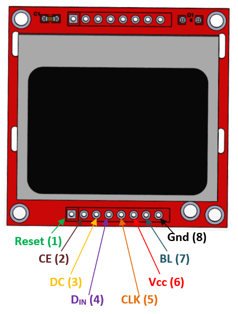

# PCD8544 - 48 × 84 pixels matrix LCD

This is the famous screen that Nokia 5110 used. It's a SPI based device. This Nokia 5110 was very popular and many of us used to have it in their hands and that young generation have seen it in pictures. This LCD is quite cheap and easy to use.

## Usage

The screen is most of the time presented like this:



It uses SPI and you can add PWM to control the 4 leds brightness which are around the screen. The pin have various names like  BL or LED.

It requires as well a GPIO controller on top of the SPI device with a pin called Data Control, most often presented as DC.

In this schema, the Chip Select (active low) is most of the time called CE. The SPI Clock has to be connected to CLK or SCLK. And the MOSI pin to DIN or MOSI. Names for the pins varies a bit.

Reset pin is sometimes called RST.

Supply voltage can vary, 3.3 or 5V, up to 7V is acceptable. Make sure that there is a current limiting resistor between the brightness led and the controller you'll plug. Most of the kits you buy have it. If you don't add one, you will damage the external brightness leds.

The following example shows how to setup the screen with a PWM to control the brightness:

```csharp
SpiConnectionSettings spiConnection = new(0, 1) { ClockFrequency = 5_000_000, Mode = SpiMode.Mode0, DataFlow = DataFlow.MsbFirst, ChipSelectLineActiveState = PinValue.Low };
PwmChannel pwmChannel = PwmChannel.Create(0, 0);
SpiDevice spi = SpiDevice.Create(spiConnection);
lcd = new(27, 22, spi, pwmChannel);
```

If you don't want neither a PWM neither a reset pin, you can then pass a negative pin number for reset and null for the PWM:

```csharp
lcd = new(27, -1, spi, null);
```

## Displaying text

Like for other screen bindings in this repository you have `Write` and `SetCursorPosition` to write text and set the cursor position.

A specific font is available and optimized for the screen. The font only contains a limited number of characters and will just ignore any characters that are unknown.

```csharp
lcd.SetCursorPosition(0, 0);
lcd.WriteLine("First line");
lcd.Write("Second one");
lcd.SetCursorPosition(0, 5);
lcd.Write("last line");
```

The position of the cursor moves with the text you write. The screen has 6 lines in total. And a character is 5 pixels width and 8 pixels height.

You can as well provide your own character using the `Write(ReadOnlySpan<byte> text)` function.

## Drawing lines, rectangles and points

Point, line and rectangle primitives are available:

```csharp
lcd.DrawPoint(5, 5, true);
lcd.DrawLine(0, 0, 15, 35, true);
lcd.DrawRectangle(10, 30, 10, 20, true, true);
lcd.DrawRectangle(12, 32, 6, 16, false, true);
// You should not forget to refresh to draw everything
lcd.Refresh();
```

Each can take `Point`, `Size` and `Rectangle` as well as input. You have to decide if you want to have the point on or off and if you fill or not the rectangle.

Also you should `Refresh` the screen once you'll finish your drawing. All drawing are in the memory and needs to be pushed to the screen.

## Displaying raw images

The function SetByteMap allows you to draw anything, you'll just need to provide the raw buffer. Size is 504 bytes representing from the top left part columns of 8 pixels up to the right up to the next raw. A total of 6 raws are available with 84 columns each.

Here is an example on how you can convert an existing image to extract the raw data:

```csharp
Bitmap bitmapNokia = new(Path.Combine("nokia_bw.bmp"), true);
var bitmap2 = BitmapToByteArray(bitmapNokia);
lcd.SetByteMap(bitmap2);
lcd.Refresh();

byte[] BitmapToByteArray(Bitmap bitmap)
{
    if ((bitmap.Width != Pcd8544.PixelScreenSize.Width) || (bitmap.Height != Pcd8544.PixelScreenSize.Height))
    {
        throw new ArgumentException($"{nameof(bitmap)} should be same size as the screen {Pcd8544.PixelScreenSize.Width}x{Pcd8544.PixelScreenSize.Height}");
    }

    byte[] toReturn = new byte[Pcd8544.ScreenSizeBytes];
    int width = Pcd8544.Size.Width;
    Color colWhite = Color.FromArgb(255, 255, 255, 255);
    for (int position = 0; position < Pcd8544.ScreenSizeBytes; position++)
    {
        byte toStore = 0;
        for (int bit = 0; bit < 8; bit++)
        {
            toStore = (byte)(toStore | ((bitmap.GetPixel(position % width, position / width * 8 + bit) == colWhite ? 0 : 1) << bit));
        }

        toReturn[position] = toStore;
    }

    return toReturn;
}
```

In case you want to convert existing images which have a different size than the 84x48 screen size, you have to resize the picture like this:

```csharp
// Open a non bitmap and resize it
Bitmap bitmapLarge = new(Image.FromFile(Path.Combine("nonbmp.jpg")), Pcd8544.PixelScreenSize);
Bitmap newBitmapSmall1color = bitmapLarge.Clone(new Rectangle(0, 0, Pcd8544.PixelScreenSize.Width, Pcd8544.PixelScreenSize.Height), System.Drawing.Imaging.PixelFormat.Format1bppIndexed);
var bitmap3 = BitmapToByteArray(newBitmapSmall1color);
```

Note: you may want to reverse the colors first depending on what you want.

## Advance functions

You can adjust couple of factors like `Bias`,  `Temperature`, `Contrast` and `Brightness`. Teh [samples](./samples/Program.cs) will run thru all of them so you can understand the impact of each of them.

In general, it is recommended to leave Temperature to the 0 coefficient, if you are in normal conditions. The Bias can be left to 4 as well as a default value for normal conditions.

Then you can use the Contrast property to properly adjust the contrast. A value around 0x30 is usually a good one for normal conditions.

But you may have to adjust those depending on the conditions of lights, temperature you are in.

### Brightness

The brightness is controlling the PWM. If you have not passed any PWM controller, this has no effect on the screen.
Brightness goes from 0.0 to 0.1f.

```csharp
lcd.BacklightBrightness = 0.2f;
```

### InverseMode

An invert mode is available, it just revert the screen colors. So white pixels become black and vice versa

```csharp
lcd.InverseMode = true;
```

### Enabled

You can switch on or off the screen fully with the `Enabled` property:

```csharp
lcd.Enabled = true;
```

## Reference

- Data sheet: https://www.sparkfun.com/datasheets/LCD/Monochrome/Nokia5110.pdf