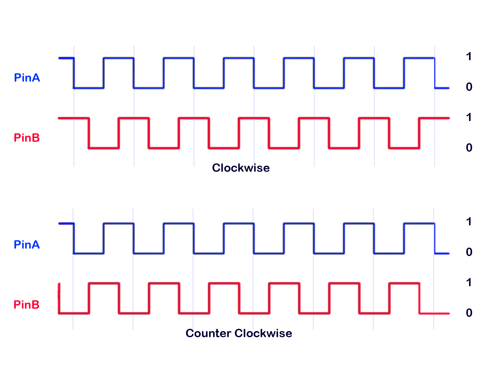

# Incremental Rotary Encoder

## Summary
A Rotary encoder is a device that detects angular position. One use of this is similar to a volume control on an FM radio where the user turns a shaft and the loudness of the broadcast is changed. Incremental rotary encoders do not provide information on their exact position but supply information about how much they have moved and in which direction.

Typically a rotary encoder will have two outputs A and B, perhaps called clock and data. For each part of a rotation then the A pin will provide a clock signal and the B pin will provide a data signal that is out of phase with the clock. The sign of the phase difference between the pins indicates the direction of rotation.

From above if we look at Pin B (data) at the time of a falling edge on Pin A (clk) then the if the value of pin P is 1 then the direction is clockwise and if it is 0 then the rotation is counter clockwise.

## Binding Notes

This binding implements a rotary encoder as a generic class `RotaryEncoder<T>`. As it is a generic class then the type T can be whatever is appropiate for the task as long as it is nummeric. For example it could be set up as an integer that has a range of 0..100 and each step incrments or decrements the value by 1. It coould also be set up as a tuning dial for an FM radio that is a decimal with a range of 88.0 to 108.0 with a step of 0.1. It is probably best not to use a float or double value as the lack of absolute mathematical precision can cause issues.

The code below shows an example of using the encoder as an FM tuner control.

    using(GpioController controller = new GpioController())
    {
        // create a RotaryEncoder that represents an FM Radio tuning dial with a range of 88 -> 108 MHz
        RotaryEncoder<decimal> encoder = new RotaryEncoder<decimal>(new GpioController(), pinA: 5, pinB: 6, pulseIncrement: 0.1M, rangeMin: 88.0M, rangeMax: 108.0M) { Value = 88 };

        encoder.ValueChanged += (o, e) =>
        {
            Console.WriteLine($"Value {e.Value}");
        };

        // Do Other Stuff
    }

This binding also features 

- Debounce functionality on the clock signal.
- Acceleration so that rotating the encoder moves it futher the faster the rotation.
- Events when the value changes.
