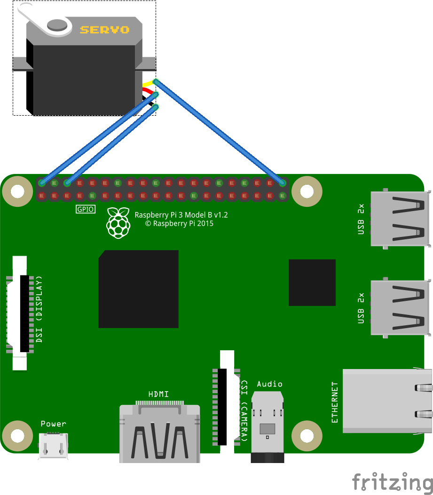

# Example of servomotor using software PWM

## Schematic

Simply connect your servomotor pilot pin (usually orange) to GPIO21 (physical pin 40), the ground to the ground (physical pin 6) and the VCC to +5V (physical pin 2).



Note: servomotors are consumming quite a lot. Make sure you have powered enought your device.

## Code

You can create a servomotor with the following line:

```csharp
ServoMotor servo = new ServoMotor(21, new ServoMotorDefinition(540, 2470));
```

Make sure you are using the following namespace: ```Iot.Device.Servo```

In the constructor, you will need to pass the following elements by order:
- the GPIO pin you want to use for the sofware PWM, here 21
- a servomotor definition, refer to the main [servomotor documentation](../README.md) for more information

To turn your servomotor, just setup an angle:

```csharp
servo.Angle = 120;
```

Here is a full example. In this example, the servomotor from its 2 extrems positions every second. 

Note that we setup a maximum angle of 100. So setting the angle to 100 will move the servo to its maximum turned position. And setting it to 0 will turn it to its minimum rotation one.

```csharp
using System;
using Iot.Device.Servo;
using System.Diagnostics;
using System.Device.Gpio;
using System.Threading;

class Program
{

    static void Main(string[] args)
    {
        Console.WriteLine("Hello Servo!");

        // example of software PWM piloted Servo on GPIO 21
        ServoMotor servo = new ServoMotor(21, new ServoMotorDefinition(540, 2470, 20000, 100));
        // example of hardware PWM piloted Servo on chip 0 channel 0
        // ServoMotor servo = new ServoMotor(0, 0, new ServoMotorDefinition(540, 2470, 20000, 100));
        if (servo.IsRunningHardwarePwm)
            Console.WriteLine("We are running on hardware PWM");
        else
            Console.WriteLine("We are running on software PWM");

        while (true)
        {
            servo.Angle = 0;
            Thread.Sleep(1000);
            servo.Angle = 100;
            Thread.Sleep(1000);
        }
    }
}

```
## Remarks

If your board supports hardware PWM, you can use it as well. To make it happening, let say on chip 0 and channel 0, you can use the following code to create the servomotor instead of the one using the GPIO 21:

```csharp
ServoMotor servo = new ServoMotor(0, 0, new ServoMotorDefinition(540, 2470));
```

You can check if you have hardware PWM with the following command:

```
ls /sys/class/pwm
```

If the directory is not empty, then you have harware PWM support.

Always prefer hardware PWM to sofware PWM. They are much more efficient.