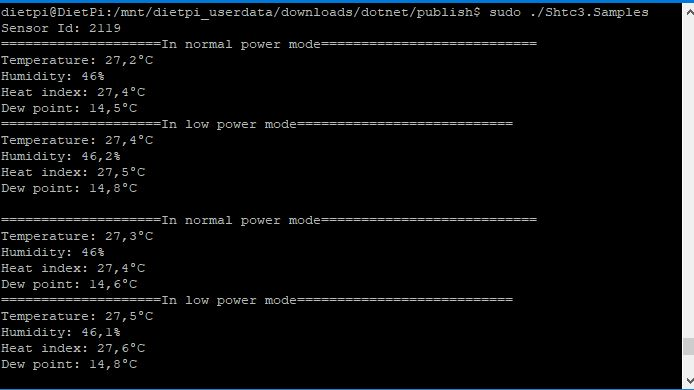

# SHTC3 - Temperature & Humidity Sensor

SHTC3 is a digital humidity and temperature sensor designed especially for battery-driven high-volume consumer electronics application.
To reduce power cosumption this project use capability of sensor to allow measurement in low power mode and active sleep mode.

## Documentation

- https://www.sensirion.com/fileadmin/user_upload/customers/sensirion/Dokumente/2_Humidity_Sensors/Datasheets/Sensirion_Humidity_Sensors_SHTC3_Datasheet.pdf

## Usage

### Hardware Required
* SHTC3
* Male/Female Jumper Wires

### Circuit
* SCL - SCL
* SDA - SDA
* VCC - 3.3V
* GND - GND

### Code

```csharp
I2cConnectionSettings settings = new I2cConnectionSettings(1, Shtc3.DefaultI2cAddress);
I2cDevice device = I2cDevice.Create(settings);

using (Shtc3 sensor = new Shtc3(device))
{
    Console.WriteLine($"Sensor Id: {sensor.Id}");

    while (true)
    {
            if (sensor.TryGetTemperatureAndHumidity(out var temperature, out var relativeHumidity))
            {
                Console.WriteLine($"Temperature: {temperature.DegreesCelsius:0.#}\u00B0C");
                Console.WriteLine($"Relative humidity: {relativeHumidity.Percent:0.#}%");
                // WeatherHelper supports more calculations, such as saturated vapor pressure, actual vapor pressure and absolute humidity.
                Console.WriteLine($"Heat index: {WeatherHelper.CalculateHeatIndex(temperature, relativeHumidity).DegreesCelsius:0.#}\u00B0C");
                Console.WriteLine($"Dew point: {WeatherHelper.CalculateDewPoint(temperature, relativeHumidity).DegreesCelsius:0.#}\u00B0C");
                Console.WriteLine();
            }

        sensor.Sleep();

        Thread.Sleep(1000);
    }

}
```

### Result

