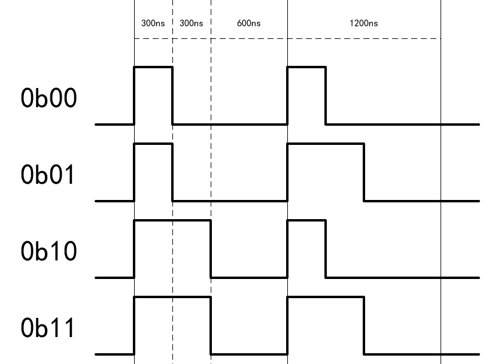

# SK6812RGBW - Intelligent control LED integrated light source

SK6812RGBW is a 5050-package addressable single-pixel LED. Similar to the WS2812, any number of LEDs can be controlled via a single data line.

Unlike WS2812, SK6812RGBW adds a color channel, usually white, and the data length of a single pixel becomes 32 bits.

This device binding provides required data format to output SK6812RGBW through the MOSI of SPI, and it should be noted that this binding needs to use a specific range of SPI frequencies to output a specific time length of signal. At the same time, the chip selection signal of the SPI will be ignored.

## Documentation

- [Introduce](http://www.normandled.com/Product/view/id/799.html)
- [Datasheet](http://www.normandled.com/upload/201603/SK6812%20RGBW%20LED%20Datasheet.pdf)

## Typical application circuit


## SPI MOSI Timing

There is 8 SPI bits for 2 SK6812RGBW data bits.

The SPI clock frequency can be 3.2MHz - 4MHz.



## Usage

Here is an example how to use the SK6812RGBW, **channel alpha is for white**.

```csharp
using System;
using System.Device.Spi;
using System.Drawing;
using System.Threading;
using Iot.Device.Sk6812rgbw;

var random = new Random();

using SpiDevice spiDevice = SpiDevice.Create(new SpiConnectionSettings(0, 0)
{
    ClockFrequency = Sk6812rgbw.SpiClockFrequency
});
using Sk6812rgbw sk6812rgbw = new Sk6812rgbw(spiDevice, 16);

while (true)
{
    for (var i = 0; i < sk6812rgbw.Pixels.Length; i++)
    {
        sk6812rgbw.Pixels[i] = Color.FromArgb(random.Next(256), random.Next(256), random.Next(256), random.Next(256));
    }

    sk6812rgbw.Flush();
    Thread.Sleep(1000);
}

```
