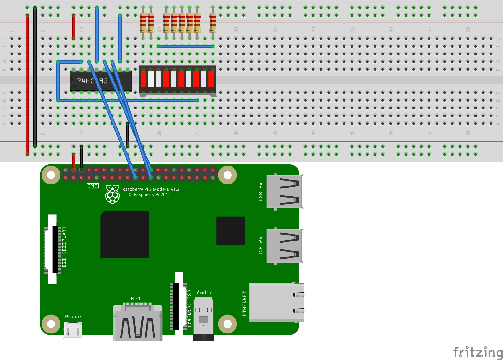

# SN74HC595 -- 8-Bit Shift Register

A shift register enables controlling multiple devices, like LEDs, from a small number of pins. It requires using 3-5 pins to control 8 outputs. Shift registers can be daisy chained without requiring additional pins, enabling addressing a larger number of devices, limited only by voltage and the algorithms you define.


The [binding](Sn74hc595.cs) abstracts the interaction with the data register, the register clock and other shift register capabilities. The binding enables interaction via GPIO or SPI. The shift register is not exposed or advertised as an SPI device, however, the required protocol is  SPI compatible.

The [SN74HC595 sample](samples/README.md) demonstrates how to use the shift register with GPIO and/or SPI.

## Using GPIO

The binding can use `GpioController` pins to control the shift register. It relies on a GPIO pin mapping to describe the 3-5 required  pins that will be used.

The following example code demonstrates how to use a shift register with GPIO.

```csharp
var sr = new Sn74hc595(Sn74hc595.PinMapping.Matching);

// Light up three of first four LEDs
sr.Shift(1);
sr.Shift(1);
sr.Shift(0);
sr.Shift(1);
sr.Latch();

// Clear register
sr.ShiftClear();

// Write to all 8 registers with a byte value
sr.ShiftByte(170);
```

The following diagram demonstrates the required wiring using the `PinMapping.Matching` mapping.


## Using SPI

The bindings can use a `SpiDevice` to control the shift register. The SPI protocol maps to the three required GPIO pins. The additional two GPIO pins, for *output enable* and  *shift register clear* are optional and can still be used.


The following example code demonstrates how to use a shift register with SPI.

```csharp
var settings = new SpiConnectionSettings(0, 0);
var spiDevice = SpiDevice.Create(settings);
var sr = new Sn74hc595(spiDevice);

// Light up three of first four LEDs
// The Shift() method is dissallowed when using SPI
ShiftByte(11);

// Clear register
sr.ShiftClear();

// Write to all 8 registers with a byte value
sr.ShiftByte(170);
```

The following diagram demonstrates the required wiring using SPI. If GPIO is also used, then two more wires would be required for shift register pins 13 and 10, which would be controlled with a `GpioController`. A constructor that takes both an `SpiDevice` and `GpioController` is provided for that case.



## Daisy-chaining

The binding supports daisy chaining, either GPIO or SPI. The GPIO-based example below demonstrates how to declare support for controlling/addressing two -- daisy-chained -- shift registers. This is specified by the last (integer) value in the constructor.

```csharp
using var controller = new GpioController();
var sr = new Sn74hc595(Sn74hc595.PinMapping.Matching, controller, false, 2);

// Write 2 byte value to shift registers
sr.ShiftBytes(4095);
```

The following wiring diagram can be used to support 2 shift registers.


## Fritizing diagrams


* [One shift register -- GPIO](sn74hc595-led-bar-graph.fzz)
* [Two shift registers -- GPIO](sn74hc595-led-bar-graph-double-up.fzz)
* [One shift register -- SPI](sn74hc595-led-bar-graph-spi.fzz)

## Resources

* Datasheet: https://www.ti.com/lit/ds/symlink/sn74hc595.pdf
* Adafruit: https://www.adafruit.com/product/450
* Tutotial: https://www.youtube.com/watch?v=6fVbJbNPrEU