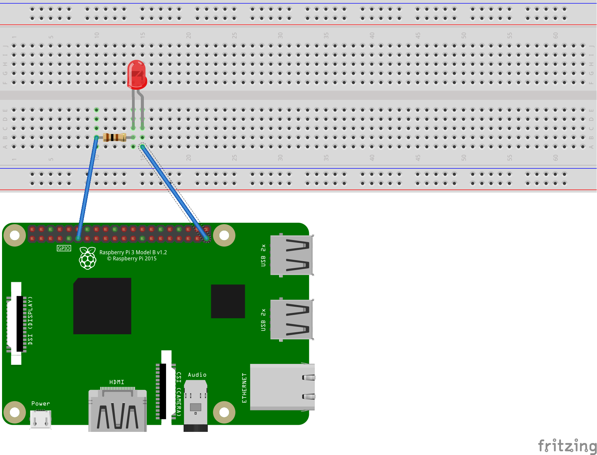

# Led PWM with softPwm

## Schematic

This example shows how to use the software PWM with a Led. Simply connect the Led with a 100 ohms resistor on GPIO 17 (physical pin 11).



## Code

To initialize the software, you need to add ```using System.Device.Pwm.Drivers;``` and ```using System.Device.Pwm```.

```csharp
var PwmController = new PwmController(new SoftPwm());
```

You then need to open the PWM and start it. Please note that the first parameter is the GPIO you are using, in our case, 17. The second parameter is always ignored. It is used only for hardware PWM. The following code will open the software PWM and start it with a 200Hz frequency and a duty cycle of 0. Duty cycle is value between 0.0 and 100.0. 100.0 represents 100%. 

```csharp
PwmController.OpenChannel(17, 0);
PwmController.StartWriting(17,0, 200, 0);        
```

Then you can change the duty cycle during the execution, for example to 50% here:

```csharp
PwmController.ChangeDutyCycle(17, 0, 50);
```

Note: to release the GPIO pin, you have to close the PWM:

```csharp
PwmController.CloseChannel(17, 0);
```

Here is a full example:

```csharp
using System;
using System.Device.Pwm;
using System.Device.Pwm.Drivers;
using System.Diagnostics;
using System.Device.Gpio;
using System.Threading;

class Program
{

    static void Main(string[] args)
    {
        Console.WriteLine("Hello PWM!");
        var PwmController = new PwmController(new SoftPwm());
        PwmController.OpenChannel(17, 0);
        PwmController.StartWriting(17,0, 200, 0);        
        while(true)
        {
            for(int i = 0; i< 100; i++)
            {
                PwmController.ChangeDutyCycle(17, 0, i);       
                Thread.Sleep(100);
            }
        }        
    }
}
```

## Other Example 

You will find another example of SoftPwm in the [Servo Motor class](/src/devices/Servo/samples/README.md). This Servomotor sample uses a precision timer.


