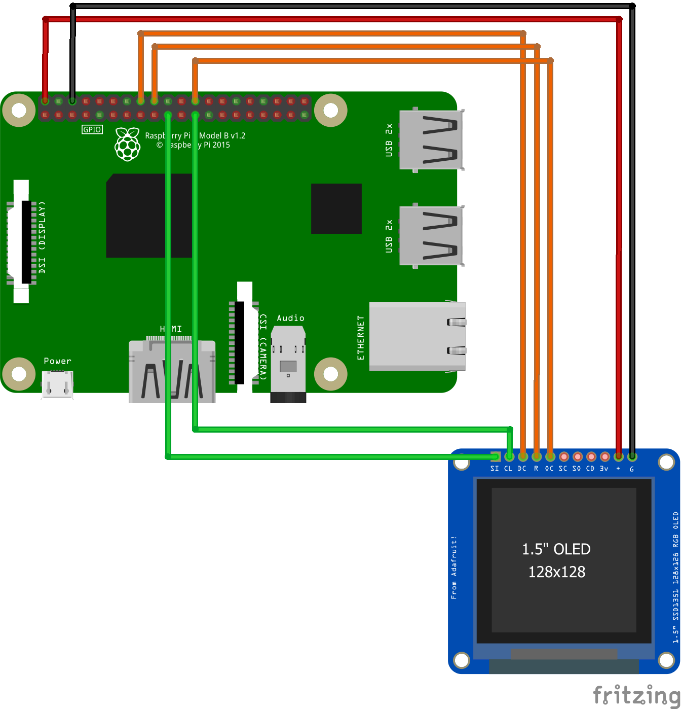

# Solomon Systech Ssd1351 - CMOS OLED

The SSD1351 is a single-chip CMOS OLED driver with controller for organic/polymer light emitting diode dot-matrix graphic display system. It consists of 384 segments and 128 commons. This IC is designed for Common Cathode type OLED panel.

## Documentation

[Adafruit SSD1351 Arduino Library](https://github.com/adafruit/Adafruit-SSD1351-library) 

### Device Family

**SSD1351**: https://cdn-shop.adafruit.com/datasheets/SSD1351-Revision+1.3.pdf

### Related Devices

- [OLED Breakout Board - 16-bit Color 1.5"](https://www.adafruit.com/product/1431)
- [OLED Breakout Board - 16-bit Color 1.27"](https://www.adafruit.com/product/1673)

## Board

This uses AdaFruit breakount board that is wired to a Raspberry Pi as below

| Function      | Raspberry Pi | SSD 1351  |
|:------------- |:-------------| -----:|
| 5v Power | Pin2 - 5v | + |
| Ground | Pin4 - Gnd      |  G |
| SPI Output | Pin19 - MOSI_0      | SI |
| SPI Clock | Pin23 - SCLK_0 | CL |
| /Data Code | Pin16 - GPIO23     | DC |
| /Reset | Pin18 - GPIO24 | R |
| SPI Enable | Pin24  CEO_0 | OC |

## Binding Notes

This binding currently only supports commands and raw data. Eventually, the plan is to create a graphics library that can send text and images to the device.

The following connection types are supported by this binding.

- [X] SPI
