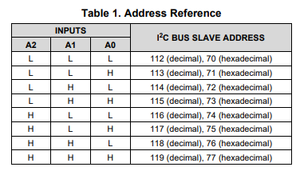

# TCA954X - TCA954X Low-Voltage Multi-Channel I2C Switch with Reset

The TCA954X/PCA954X group of devices is a set of I2C switches. Several types are available, with 2, 4 or 8 channels, and different voltage specifications. The first letter is sometimes also "P".

The TCA9548A device has eight bidirectional translating switches that can be controlled through the I2C bus. The SCL/SDA upstream pair fans out to eight downstream pairs, or channels.

All operations for basic usage has been developed. If needed, RESET operation can also be implemented.

## Documentation


TCA9548A [datasheet](https://www.ti.com/lit/ds/symlink/tca9548a.pdf)

You will find this device as ["Adafruit TCA9548A 1-to-8 I2C Multiplexer Breakout"](https://learn.adafruit.com/adafruit-tca9548a-1-to-8-i2c-multiplexer-breakout)

A list of [different variants](https://www.ti.com/interface/i2c/switches-and-multiplexers/products.html?keyMatch=TCA9548) is available on the Texas Instruments Website.

## Usage

Create a ```Tca9548A``` class and pass the I2C device. The default I2C address is provided in the class.

```csharp
            Console.WriteLine("Hello TCA9548A!");
            var bus = I2cBus.Create(1);
            Tca9548A tca9548a = new Tca9548A(bus.CreateDevice(Tca9548A.DefaultI2cAddress));

            // Get all connected I2C interfaces
            foreach (var channelBuses in tca9548a)
            {
                var deviceAddress = ((Tca9548AChannelBus)channelBuses).PerformBusScan();
                foreach (var device in deviceAddress)
                {
                    if (device == Bno055Sensor.DefaultI2cAddress || device == Bno055Sensor.SecondI2cAddress)
                    {
                        Bno055Sensor bno055Sensor = new Bno055Sensor(channelBuses.CreateDevice(device));
                        Console.WriteLine($"Id: {bno055Sensor.Info.ChipId}, AccId: {bno055Sensor.Info.AcceleratorId}, GyroId: {bno055Sensor.Info.GyroscopeId}, MagId: {bno055Sensor.Info.MagnetometerId}");
                        Console.WriteLine($"Firmware version: {bno055Sensor.Info.FirmwareVersion}, Bootloader: {bno055Sensor.Info.BootloaderVersion}");
                        Console.WriteLine($"Temperature source: {bno055Sensor.TemperatureSource}, Operation mode: {bno055Sensor.OperationMode}, Units: {bno055Sensor.Units}");
                        Console.WriteLine($"Powermode: {bno055Sensor.PowerMode}");
                        var calibrationStatus = bno055Sensor.GetCalibrationStatus();
                        Console.WriteLine($"Calibration Status : {calibrationStatus}");
                        var magneto = bno055Sensor.Magnetometer;
                        Console.WriteLine($"Magnetometer X: {magneto.X} Y: {magneto.Y} Z: {magneto.Z}");
                        var gyro = bno055Sensor.Gyroscope;
                        Console.WriteLine($"Gyroscope X: {gyro.X} Y: {gyro.Y} Z: {gyro.Z}");
                        var accele = bno055Sensor.Accelerometer;
                        Console.WriteLine($"Acceleration X: {accele.X} Y: {accele.Y} Z: {accele.Z}");
                        var orien = bno055Sensor.Orientation;
                        Console.WriteLine($"Orientation Heading: {orien.X} Roll: {orien.Y} Pitch: {orien.Z}");
                        var line = bno055Sensor.LinearAcceleration;
                        Console.WriteLine($"Linear acceleration X: {line.X} Y: {line.Y} Z: {line.Z}");
                        var gravity = bno055Sensor.Gravity;
                        Console.WriteLine($"Gravity X: {gravity.X} Y: {gravity.Y} Z: {gravity.Z}");
                        var qua = bno055Sensor.Quaternion;
                        Console.WriteLine($"Quaternion X: {qua.X} Y: {qua.Y} Z: {qua.Z} W: {qua.W}");
                        var temp = bno055Sensor.Temperature.DegreesCelsius;
                        Console.WriteLine($"Temperature: {temp} °C");
                    }
                    else if (device == Bmp180.DefaultI2cAddress)
                    {
                        using Bmp180 i2cBmp280 = new(channelBuses.CreateDevice(device));
                        // set samplings
                        i2cBmp280.SetSampling(Sampling.Standard);
                        // read values
                        Temperature tempValue = i2cBmp280.ReadTemperature();
                        Console.WriteLine($"Temperature: {tempValue.DegreesCelsius:0.#}\u00B0C");
                        Pressure preValue = i2cBmp280.ReadPressure();
                        Console.WriteLine($"Pressure: {preValue.Hectopascals:0.##}hPa");

                        // Note that if you already have the pressure value and the temperature, you could also calculate altitude by
                        // calling WeatherHelper.CalculateAltitude(preValue, Pressure.MeanSeaLevel, tempValue) which would be more performant.
                        Length altValue = i2cBmp280.ReadAltitude(WeatherHelper.MeanSeaLevel);

                        Console.WriteLine($"Altitude: {altValue:0.##}m");
                        Thread.Sleep(1000);

                        // set higher sampling
                        i2cBmp280.SetSampling(Sampling.UltraLowPower);

                        // read values
                        tempValue = i2cBmp280.ReadTemperature();
                        Console.WriteLine($"Temperature: {tempValue.DegreesCelsius:0.#}\u00B0C");
                        preValue = i2cBmp280.ReadPressure();
                        Console.WriteLine($"Pressure: {preValue.Hectopascals:0.##}hPa");

                        // Note that if you already have the pressure value and the temperature, you could also calculate altitude by
                        // calling WeatherHelper.CalculateAltitude(preValue, Pressure.MeanSeaLevel, tempValue) which would be more performant.
                        altValue = i2cBmp280.ReadAltitude(WeatherHelper.MeanSeaLevel);
                        Console.WriteLine($"Altitude: {altValue:0.##}m");
                    }

                    Thread.Sleep(1000);
                }

            }
```

### Sample wiring

**Important** to understand:
If you are getting lower data rate from sensor connected via Multiplexer on Raspberry Pi, you need to adjust the bus speed.

This example uses the I2C bus 1 with GPIO 2 and 3 on raspberry pi and gathers data from to BNO055 sensors and 4 BMP180 sensors over TCA9548A Mux


## Possible TCA9548A Addresses



## TCA9546A - Low Voltage 4-Channel I2C

TCA9546A [datasheet](https://www.ti.com/lit/ds/symlink/tca9546a.pdf)
You can use the same class to control the 4-Channel Multiplexer also.
