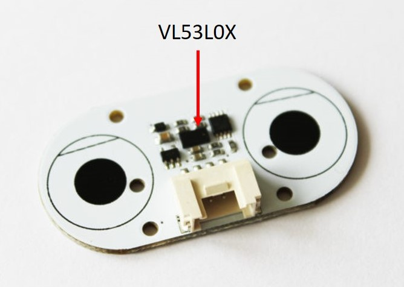

# VL53L0X Sensor

## Summary

The VL53L0X sensor is a Time-to-Flight sensor measuring precisely distances. The sensor allows you to get precise short distance measurement (from 5 millimeters to 2 meters) as well as long distance measurement (up to 8 meters but with a decreased precision). This sensor is a laser ranging sensor. So it is using laser pulses to measure the distances.

## Device Family



**VL53L0X** [datasheet](https://www.st.com/content/st_com/en/products/embedded-software/proximity-sensors-software/stsw-img005.html)

You will find this device as ["Distance Sensor"](https://www.dexterindustries.com/product/distance-sensor/) or ["Adafruit VL53L0X Time of Flight Distance Sensor - ~30 to 1000mm"](https://www.adafruit.com/product/3317)

## Usage

All calibration and all setup of the sensor is done fully transparently for you. Just create a class and read either once the distance, either using the continuous measurement method.

```csharp
Vl53L0X vL53L0X = new Vl53L0X(new UnixI2cDevice(new I2cConnectionSettings(1, Vl53L0X.DefaultI2cAddress)));
Console.WriteLine($"Rev: {vL53L0X.Info.Revision}, Prod: {vL53L0X.Info.ProductId}, Mod: {vL53L0X.Info.ModuleId}");
while (!Console.KeyAvailable)
{
    try
    {        
        Console.WriteLine($"Distance: {vL53L0X.DistanceContinousMillimeters}");
    }
    catch (Exception ex)
    {
        Console.WriteLine($"Exception: {ex.Message}");
    }
    Thread.Sleep(500);
}
```

Be aware that when reading a distance using the Continuous or Single measurement feature, you can get an exception, you should trap it.

You can as well get a single measurement, in this case, the precision can be lower and we do recommend to use the ```GetDistanceSingleMillimeters(true)``` which will return an ```OperantionRange.OutOfRange``` in case of any exception an average value with a number of ```MaxTryReadSingle``` which is 3 be default but that you can adjust.

You can adjust the type of measurement you want. By default, the sensor is put into long range. This does allow to have a quite accurate (+-5%) precision within 2 meters but still can measure distances up to 8 meters (accuracy much less correct). You can switch to short range using the ```SetPrecision``` function. If you want to setup your own mode, you should use in conjunction the ```SetSignalRateLimit``` and the ```SetVcselPulsePeriod``` functions plus the ```HighResolution``` property like in the below example: 

```csharp
HighResolution = false;
SetSignalRateLimit(0.25);
SetVcselPulsePeriod(VcselType.VcselPeriodPreRange, PeriodPulse.Period14);
SetVcselPulsePeriod(VcselType.VcselPeriodFinalRange, PeriodPulse.Period10);
```

Please refer to the documentation to understand the impact of changing the various pluses as well as using the high resolution precision measurement.

