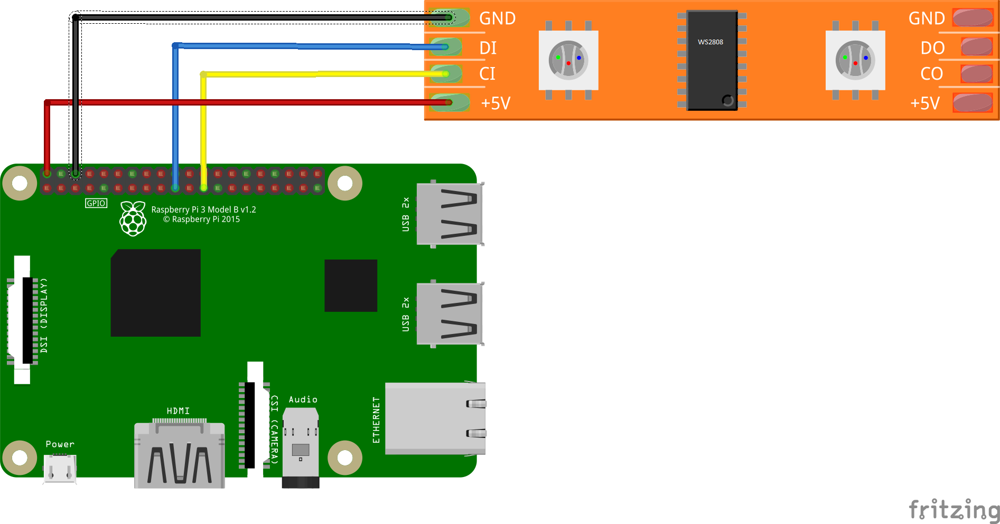

# Ws28xx / SK6812 LED drivers

This binding allows you to update the RGB LEDs on Ws28xx / SK6812 and based strips and matrices.

To see how to use the binding in code, see the [sample](samples/Ws28xx_Samples/Program.cs).

## Documentation

* WS2812B: [Datasheet](https://cdn-shop.adafruit.com/datasheets/WS2812B.pdf)
* WS2808: [Datasheet](https://datasheetspdf.com/pdf-file/806051/Worldsemi/WS2801/1)
* SK6812: [Datasheet](https://cdn-shop.adafruit.com/product-files/2757/p2757_SK6812RGBW_REV01.pdf)
* [Neo pixels guide](https://learn.adafruit.com/adafruit-neopixel-uberguide)
* [Neo pixels x8 stick](https://www.adafruit.com/product/1426)

## Board

### Neo pixels / SK6812


### WS2808



## Usage

```csharp
using System;
using System.Collections.Generic;
using System.Device.Spi;
using System.Drawing;
using Iot.Device.Graphics;
using Iot.Device.Ws28xx;

// Configure the count of pixels
const int Count = 8;
Console.Clear();

SpiConnectionSettings settings = new(0, 0)
{
    ClockFrequency = 2_400_000,
    Mode = SpiMode.Mode0,
    DataBitLength = 8
};
using SpiDevice spi = SpiDevice.Create(settings);

Ws28xx neo = new Ws2808(spi, count);
// Ws28xx neo = new Ws2812b(spi, Count);

while (true)
{
    Rainbow(neo, Count);
    System.Threading.Thread.Sleep(100);
}

void Rainbow(Ws28xx neo, int count, int iterations = 1)
{
    BitmapImage img = neo.Image;
    for (var i = 0; i < 255 * iterations; i++)
    {
        for (var j = 0; j < count; j++)
        {
            img.SetPixel(j, 0, Wheel((i + j) & 255));
        }

        neo.Update();
    }
}
```

***Note:***

Using the SK6812 is almost the same, but the alpha channel of the color is used for the white LED. This means that the predefined color definitions (like ```System.Drawing.Color.Red```) will not work correctly as they have the alpha channel set to 255 (0xFF). That will turn the white LED always on. See the [sample](samples/SK6812_Samples/Programs.cs) for the main differences to the above code.
Because ```System.Drawing.Color``` is a readonly struct, it's not possible to change the any channel directly. In order to correctly set Red, use ```Color.FromArgb(0, 255, 0, 0)```. For setting the white LED, use ```Color.FromArgb(255, 0, 0, 0)```. It's also possible to use an existing definition and remove the white channel like this:

```csharp
var color = Color.HotPink;
var newColor = Color.FromArgb(0, color.R, color.G, color.B);
```

## Binding Notes

### Raspberry Pi setup (/boot/config.txt)

* Make sure SPI is enabled

```text
dtparam=spi=on
```

* To make sure SPI doesn't change speed fix the core clock:

```text
core_freq=250
core_freq_min=250
```
